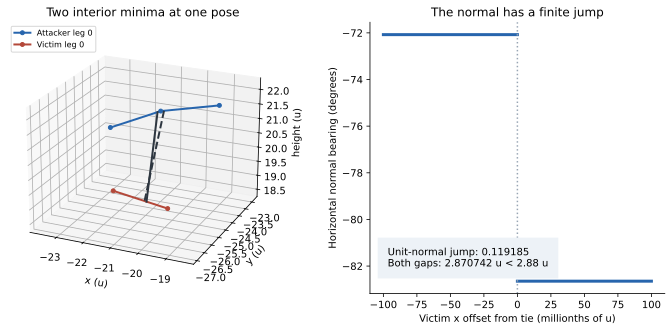
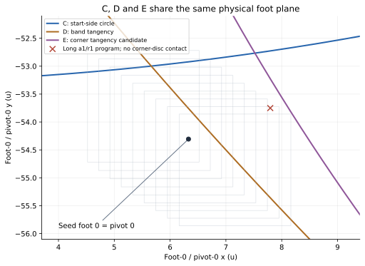
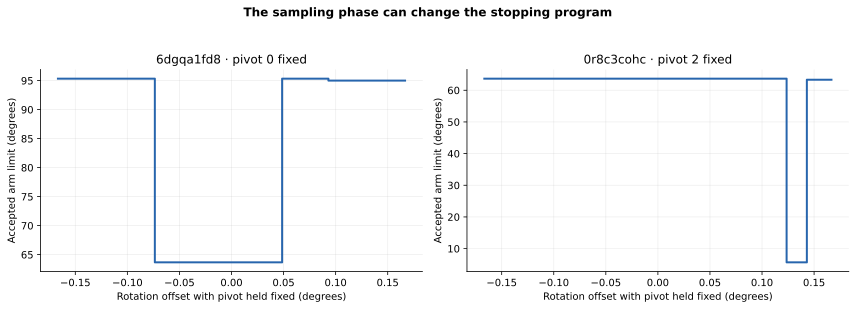

# Tau: contact bounds and curved certificate cells

Response to **Brief 2: three contraction lemmas for the throw proof, and the oriented split at the jumping walls**. Computed 18 September 2026 against `e32f09d5be9600212c3d5294b70a3835f0517427`, the revision specified in the brief. Angles in the formulas are radians; numerical tables label degrees explicitly.

**The useful replacement is a union of contact branches, contracted against a verified contact shell.** A and B have small, explicit constants for an isolated smooth minimum or one fixed pair of chords. They are false for the globally selected polyline contact without that qualification. C is a valid geometric contractor once shell membership has been established. D, as stated for the engine, is false.

There is also a substantial correction to Job 2: the engine's sampling phase can change the stopping program by tens of degrees with the pivot held fixed. Several apparent corner walls are not determined by a corner tangency. The geometric charts remain useful, but their cells need phase and state-machine guards.

The report supplies proofs, numerical predictions, actual engine counterexamples, and formulas for the cells. It does **not** claim to have certified the whole throw box or a new dead region. `throw-cert.js` was not present among the supplied files or in the inspected PR branches, and the 21³ map data was not attached. This is not an audit of that checker's implementation.

## Index

1. [What is proved, and what fails](#results)
2. [A — contact-point sensitivity](#lemma-a)
3. [B — normal sensitivity](#lemma-b)
4. [A contacting polyline counterexample](#counterexample)
5. [C — the shell contractor](#lemma-c)
6. [Numerical predictions for the small box](#numbers)
7. [D — contraction, shell residuals, and the barrier](#lemma-d)
8. [Explicit curved cells and their grids](#cells)
9. [The three seeds: verified geometry and program changes](#seeds)
10. [Implementation order and reproducibility](#implementation)

<a id="results"></a>
## 1. What is proved, and what fails

| Claim | Correct version |
|---|---|
| A: closest-point parameters are Lipschitz | Yes along an isolated, nondegenerate smooth minimizing branch; yes for one nonparallel segment pair, including endpoint clamping. No global bound across competing polyline minima. |
| B: the closest-point normal is Lipschitz | Yes on the same branches. On two interior straight segments its direction depends only on their directions, so translation contributes **zero** to normal rotation. No global bound across the engine's feature ties. |
| C: the contact shell limits normal width | Yes. The exact width bound below includes a `sec β` factor and a lever-arm term. It does not need an additional curvature term when the geometric bounds hold throughout the comparison region. |
| Shell membership follows from Lemma 1 | No. Lemma 1 follows one old material point. The shortest distance after rotation and reselection is a different quantity. A verified distance residual is needed. |
| D: the engine is a normal contraction and tangentially nonexpanding | No as stated. Locally, within a regular branch, its linearization on contact is a mass-metric projection. That provides a useful local bound, not the proposed global invariant-box theorem. |
| Every program wall is independent of rotation once the pivot is fixed | True for an equality of continuous event phases on fixed branches. False for the sampled stopping program. |

The successful minimum of two stopping envelopes at ndpxhts24 should be retained. Where both candidate events really stop the move, taking their minimum avoids an unnecessary split. That improvement does not require treating a continuous event-order swap as a jump. It also does not by itself prove a program classification that was only observed on a grid.

<a id="lemma-a"></a>
## 2. A — contact-point sensitivity

### Assumptions and notation

Use arc lengths `s, t` on the attacker and victim curves. Write

```text
w = V(t,q) − A(s),       d = |w|,
a = A_s,                b = V_t,        |a| = |b| = 1.
```

The attacker is fixed while comparing victim poses. Along the pose path and the minimizing branch, require:

- `0 < d₋ ≤ d ≤ d₊`;
- `|a·b| ≤ c̄ < 1`, and set `σ = √(1 − c̄²)`;
- an interior, isolated minimizing branch that continues throughout the path;
- for the curvature bound below, `κ = d₊/R < 1 − c̄`.

“Isolated” matters: either prove that the continued branch remains the global minimum, or keep it as one candidate among several. A crossing angle at one pose does not establish these uniform hypotheses. The absolute value in `|a·b|` also covers nearly antiparallel tangents.

For a straight path in the victim's hub and orientation, put

```text
Θ = |Δθ|,
P = |Δhub| + RΘ.
```

`P` is the integrated bound on the speed of every material point. The brief's finite-displacement pad is slightly smaller. For `Θ < π`, use

```text
P ≤ [Θ / (2 sin(Θ/2))] pad.
```

At 0.05° the multiplicative difference is about `3.2 × 10⁻⁸`. It is negligible numerically, but using `P` makes the proof exact.

### The bound

Each contact parameter satisfies

```text
|Δs|, |Δt| ≤ B,

B = [P/σ + d₊Θ/σ²] / [1 − κ/(1 − c̄)].                 (A1)
```

In the requested form, since `Θ ≤ P/R`, one can use

```text
C_A = [1/σ + κ/σ²] / [1 − κ/(1 − c̄)],
|Δφ_A| R, |Δφ_V| R ≤ C_A P.                              (A2)
```

The attacker's selected point moves by at most `B`; the victim's selected point moves in world space by at most `P+B`. Parameter displacement and world-space contact displacement should not be confused.

### Proof

Let `f(s,t,q) = |V−A|²/2`. Interior stationarity is `a·w = b·w = 0`. Its parameter Hessian is

```text
H₁₁ = 1 − w·A_ss,     H₁₂ = H₂₁ = −a·b,
H₂₂ = 1 + w·V_tt.
```

For radius-R arcs, both curvature vectors have length `1/R`. Thus

```text
H = H₀ + E,       H₀ = [[1,−c],[−c,1]],       c = a·b,
E is diagonal,    |E_ii| ≤ κ,
λ_min(H) ≥ 1 − c̄ − κ > 0.
```

Let `v` be the velocity of a fixed material point on the victim at the current contact parameter; let `ḃ_pose` be the tangent change due to rigid rotation, with `|ḃ_pose| ≤ |θ̇|`. Differentiating stationarity gives

```text
H [ṡ,ṫ]ᵀ = [a·v, −b·v − w·ḃ_pose]ᵀ.
```

Applying `H₀⁻¹` to the translation part gives numerators `(a−cb)·v` and `(ca−b)·v`, each bounded by `√(1−c²)|v|`. Its rotation part contributes at most `d₊|θ̇|/σ²` to either coordinate. Also

```text
||H₀⁻¹E||∞ ≤ κ/(1−c̄).
```

Move this last term to the left and integrate. This proves A1; A2 follows by bounding `d₊Θ ≤ κP`. The strong-convexity estimate gives local uniqueness; it does not exclude an unrelated competing minimum elsewhere on the curves.

For these particular vertical quarter circles, there is a useful extra identity at an interior stationary pair:

```text
H₁₁ = cos φ_V / cos φ_A,
H₂₂ = cos φ_A / cos φ_V,
det H = 1 − (a·b)².
```

It follows by substituting the circular curvature vectors and the stationarity equations. Interval bounds on the two φ values can therefore sharpen A1. The generic bound above avoids needing them and is already useful at 62–73°.

### One fixed chord pair, including vertices as endpoints

For one attacker segment and one victim segment, the parameter problem is a strictly convex quadratic on a rectangle whenever they are nonparallel. Its minimizer is unique and continuous as an endpoint becomes active. The corresponding bound is

```text
|Δs|, |Δt| ≤ B_seg = P/σ + d₊Θ/σ².                       (A3)
```

There is no curvature denominator. With both parameters free, the preceding proof has `E=0`. If the attacker endpoint is fixed, only `t` moves and `|ṫ| ≤ |v| + d₊|θ̇|`. If the victim endpoint is fixed, `|ṡ| ≤ |v|`; with both fixed, both parameter derivatives vanish. These bounds are no larger than A3's integrand. The piecewise derivatives integrate across active-set changes.

Here `s,t` are lengths along the chord. If the implementation instead linearly interpolates the vertex φ labels, multiply by

```text
(π/24) / [2 sin(π/48)] = 1.000714… .
```

This is a bound on **one fixed pair of segments**. Minimizing over all 144 pairs is a nonconvex selection problem. An endpoint transition within one pair and a switch between two distinct minimizing pairs are different events.

<a id="lemma-b"></a>
## 3. B — normal sensitivity

### Isolated smooth interior contact

Choose the continuous sign of `n₃ = ±(a×b)/|a×b|`. Differentiating the two perpendicularity constraints bounds its speed by

```text
|ṅ₃| ≤ (|ȧ| + |ḃ|)/σ
      ≤ (|ṡ|/R + |ṫ|/R + |θ̇|)/σ.
```

Consequently,

```text
|Δn₃| ≤ ε_smooth = (2B/R + Θ)/σ.                        (B1)
```

One way to see the first inequality is to expand `ṅ₃` in the plane spanned by `a,b`: the two prescribed dot products are `−n₃·ȧ` and `−n₃·ḃ`, and each reciprocal basis vector has length `1/σ`.

With A2 this supplies an explicit version of the requested `K pad/d` form:

```text
|Δn₃| ≤ K P/d₊,
K = (d₊/R)(2C_A + 1)/σ.                                (B2)
```

At 73° and `d₊=2.88`, this sufficient K is about 0.505. It depends on `d₊/R` and on isolation as well as angle. A universal constant depending only on the angle is not justified for arbitrary curved-curve contacts near a focal degeneracy.

### One fixed chord pair

If both closest points stay in the chord interiors, translation does not rotate the normal at all. The attacker tangent is fixed and only the victim tangent rotates:

```text
|Δn₃| ≤ Θ/σ.                                           (B3)
```

If endpoint clamping is allowed within that same pair, a safe uniform bound is

```text
|Δn₃| ≤ P/d₋ + Θ/σ.                                    (B4)
```

For example, with the attacker endpoint fixed and the victim parameter free,

```text
ẇ = (Id − bbᵀ)v − b(w·ḃ_pose).
```

Normalizing gives `|ṅ₃| ≤ |v|/d₋ + |θ̇|`. If only the victim endpoint is fixed, projection onto the plane perpendicular to the attacker segment gives `|ṅ₃| ≤ |v|/d₋`; with both endpoints fixed the same normalization bound applies. Combine these with the interior case and integrate. Thus the speed through an endpoint's normal fan is controlled **within the fixed segment-pair problem**.

### Horizontal quantities

For any of the valid branch bounds `|Δn₃| ≤ ε`, with centre horizontal fraction `h₀ > ε`,

```text
|Δhf| ≤ ε,
|Δbearing| ≤ β = ε/(h₀−ε).
```

The horizontal projection lies in a radius-ε disk about the centre projection. Following the straight segment inside that disk proves the bearing bound. An `arcsin(ε/h₀)` disk bound is also available and slightly tighter. The error in the horizontal *unit* normal is at most `2 sin(β/2)`.

At an uncertain global feature switch, form the union of the individual branch cones. Intersecting a cone about the centre's winning branch with a vertex fan can wrongly remove a valid second branch.

<a id="counterexample"></a>
## 4. A contacting polyline counterexample

This is near substep 24 of the supplied throw, with the attacker frozen and the victim translated in x. It uses the exact R and 12-chord geometry in the pinned code. Both contacts are strictly inside their respective chords; their distances are below D.

```text
Attacker: (x,y,θ) = (−12.831776146126225,
                     −26.997105145410310,
                       2.7766483918085445)

Victim at tie:       (−23.828114646314690,
                     −38.136424156513700,
                       1.3281868071241907)
```

Use leg 0 on both pieces. Segment indices are zero-based; a segment runs between vertices k and k+1.

| Quantity | Attacker segment 3 / victim segment 4 | Attacker segment 2 / victim segment 4 |
|---|---:|---:|
| Distance | 2.870742032284565 | 2.870742032284564 |
| Attacker fraction along segment | 0.0602483 | 0.9410009 |
| Victim fraction along segment | 0.5963618 | 0.5598701 |
| Chord crossing angle | 70.322665° | 74.058151° |
| n₃,x | 0.190256853 | 0.074548421 |
| n₃,y | −0.588154018 | −0.577871814 |
| n₃,z | −0.786051640 | −0.812715633 |

At victim `x−10⁻⁷`, the engine selects the first pair. At `x+10⁻⁷`, it selects the second. The limiting jumps are approximately:

| Selected quantity | Jump |
|---|---:|
| Attacker contact point | 0.359471 u |
| Victim contact point | 0.110240 u |
| 3-D unit normal | 0.119185 |

All other leg pairs have distance at least 4.626 u. This is not a nearly parallel or zero-distance example. For the two fixed directions, each interior line-pair distance is a signed linear function of this small x translation, and the two functions cross with different slopes. The branch formulas and the strict interior fractions explain the finite jump; it is not a demand to interpret the rounded tie digits as an exact algebraic equality.



The game's actual `resolvePush` produces a **0.00246518 u** difference in final hub positions from those two inputs. Exposing and running that function in memory gives exactly the same poses as the reproduced contact loop. Its final gap difference is `4.46364×10⁻⁷ u`, whereas the initial gap difference is `2.64805×10⁻⁸ u`, a ratio of about **16.86**. This also contradicts D's proposed universal scalar contraction for the engine's contact-solver stage.

This example does not say that the initial ±0.01 u box in the brief reaches this tie. It says that H1's “one leg pair, interior contact, safe hf” assumptions do not exclude the failure. The checker must establish a stronger feature condition or retain both branches.

<a id="lemma-c"></a>
## 5. C — the shell contractor

### Coordinate change and hypotheses

Let `n_c` be a fixed horizontal unit vector and `t_c = J n_c`. Carry coordinates

```text
hub = hub_c + z n_c + y t_c,
θ   = θ_c + ϑ,
(z,y,ϑ) ∈ Z × Y × T.
```

Let `d(z,y,ϑ)` be the actual selected curve/segment distance. Throughout this convex comparison box, require all active contact normals to lie within horizontal angle β of `n_c`, `hf ≥ h₋ > 0`, `β < π/2`, and `|rn| ≤ L`. At a tie, either use separate branches or establish these bounds for **every** active minimizing branch.

Suppose the reachable post-update states are known to satisfy

```text
d ∈ [D−ε₋, D+ε₊].
```

These are residual bounds on shortest distance, not the displacement error of an old contact point.

### Exact width bound

If `w_y,w_θ` are full widths, with `w_θ` in radians, then the feasible set's full normal width is at most

```text
w_z ≤ (ε₋+ε₊)/(h₋ cos β)
      + w_y tan β
      + L sec β · w_θ.                                  (C1)
```

Always intersect this with the width already available in Z. One may take `L=R`; a verified lever bound near 8 u is much better.

### Proof

The envelope theorem gives, at differentiable points, with γ the horizontal normal's angle relative to `n_c`,

```text
d_z = hf cos γ ≥ h₋ cos β,
d_y = hf sin γ,
d_θ = hf rn.
```

Hence `|d_y/d_z| ≤ tan β` and `|d_θ/d_z| ≤ L sec β`. Compare any two feasible poses by their straight segment in the enclosing box and integrate these derivatives. If `A = ∫d_z`, then

```text
|Δz| ≤ |Δd|/A + tan β |Δy| + L sec β |Δθ|,
A ≥ h₋ cos β.
```

Their distances differ by at most `ε₋+ε₊`, proving C1. A minimum of finitely many branch distances is locally Lipschitz; the same argument works almost everywhere if the same inequalities hold for every active branch on that segment.

No extra `d/R` term is needed: the cone and lever bounds already account for their variation. The factor `cos β` missing from the proposed residual term is needed. Bounds checked only on the unknown shell, rather than throughout the comparison paths, do not suffice for this proof.

### A formula that actually locates the reduced interval

A width alone does not locate Z. Use an interval-Newton contractor. For `m=mid(Z)`, interval evaluation of distance on the slice `z=m`, and a positive enclosure `J_z` for the z derivative on the whole box,

```text
S = [D−ε₋, D+ε₊],
J_z ⊇ d_z(Z,Y,T),        inf J_z > 0,

Z_new = Z ∩ { m − [d(m,Y,T) − S]/J_z }.                  (C2)
```

For example, `J_z=[h₋ cos β,h₊]` is safe when `hf ≤ h₊`. Empty intersection eliminates that branch. Keep Y and T unchanged unless other constraints reduce them. All arithmetic used as a certificate must enclose roundoff.

Alternatively, if a centre root `d(z₀,y₀,θ₀)=D` has been enclosed with normal-position error δ₀ inside the comparison box, take

```text
Z_new = Z ∩ [ z₀ − δ₀ − ε₋/(h₋ cos β)
                    − halfwidth(Y) tan β − L sec β halfwidth(T),
              z₀ + δ₀ + ε₊/(h₋ cos β)
                    + halfwidth(Y) tan β + L sec β halfwidth(T) ].   (C3)
```

Preserve this normal/tangent/rotation box or its correlated image. Converting it to an x/y box after every pass discards some of the benefit. Split touched and untouched states before imposing a contact shell; untouched states are not constrained to that shell.

<a id="numbers"></a>
## 6. Numerical predictions for the small box

For hub half-widths 0.01 u and rotation half-width 0.05°, `P=0.0342963252 u`. The finite pad is `0.0342963245 u`.

The following is a **conditional prediction**, inserting uniform `χ≥73°` (with the absolute tangent-dot convention), `d₊=2.88`, and, where needed, `d₋=2.88−P`. The centre normal has `hf=0.63`. A centre measurement alone does not certify these interval inputs or exclude another minimizing branch.

| Bound | Smooth isolated interior | Fixed chord pair, clamping allowed | Fixed chord pair, both interior |
|---|---:|---:|---:|
| Contact-parameter half-width on each leg | 0.046872 u | 0.038612 u | 0.038612 u |
| Full contact-parameter width | 0.093743 u | 0.077223 u | 0.077223 u |
| Victim contact point: world-space enclosing radius | 0.081168 u | 0.072908 u | 0.072908 u |
| Unit-normal error ε | 0.005157 | 0.012965 | 0.000913 |
| Horizontal cone half-angle | 0.472880° | 1.203839° | 0.083112° |
| Lower horizontal fraction | 0.624843 | 0.617035 | 0.629087 |

These parameter widths replace the broad distance-sublevel portions. The world-space enclosing *diameter* is twice the radius in the table. Lever estimation should use the relative contact vector, where hub translation cancels, rather than that entire world-space diameter.

For C, suppose the **post-update contractor inputs** still have `w_y=0.0282843 u` and `w_θ=0.1°`. These transverse widths themselves must be enclosed through the update; C does not prove that they stay unchanged. The normal-width predictions are:

| Verified shell total thickness | Lever bound | Smooth | Chords with clamping | Interior chords |
|---|---|---:|---:|---:|
| 0.005 u | L=R | 0.048545 u | 0.049017 u | 0.048297 u |
| 0.005 u | L=8.5 u | 0.023072 u | 0.023538 u | 0.022824 u |
| 0.001 u | L=8.5 u | 0.016670 u | 0.017054 u | 0.016466 u |

The central lever is around −8 u, so the tighter row is plausible; it must be bounded, not assumed. If the shell is instead ±0.005 u, its total thickness is 0.010 u and the residual term doubles. This distinction matters because the old point-displacement error was two-sided.

The engine's actual chord data immediately before substep 11 are `χ=73.6430°`, `d=2.834490 u`, chord pair `(3,4)`, with segment fractions `(0.461718,0.882485)`. The brief's 73° and 2.88 are suitable illustrative values, not that exact pre-correction state. Isolating the interior chord pair would make the ±0.083° cone the relevant scale. It is not justified to apply that cone through a later tie.

<a id="lemma-d"></a>
## 7. D — contraction, shell residuals, and the barrier

### What the projection interpretation really proves

Use mass coordinates `z=(hub_x,hub_y,√I θ)`, contact gap `G(z)=d(z)−D`, and gradient `a=∇G`. On a fixed regular branch, with no floor or cap,

```text
a = hf (n_x,n_y,rn/√I),
Φ(z) = z − G(z) a(z)/|a(z)|².                            (D1)
```

This is exactly the engine's one-contact pose update, expressed as a Newton correction in the mass metric. On `G=0`,

```text
DΦ = Id − uuᵀ,             u=a/|a|.
```

It kills the normal component to first order and preserves the two tangent components. At penetration `p=|G|`, differentiating D1 gives

```text
DΦ = (Id−uuᵀ) − G (Id−2uuᵀ) Hess(G)/|a|².
```

If `||Hess(G)|| ≤ M` and `|a| ≥ m`, then

```text
||DΦ − (Id−uuᵀ)|| ≤ pM/m²,
||DΦ u|| ≤ pM/m²,
||DΦ v|| ≤ (1+pM/m²)|v|       for v perpendicular to u.   (D2)
```

Thus a **pointwise derivative** in the current mass-normal direction is contracting when `pM<m²`. The normal changes between poses and steps; this is not a bound on arbitrary pairs of states solely in terms of their previous scalar distances. Tangent directions can expand, and branch switches need separate handling. The exact engine counterexample in section 4 rules out the global statement.

The supplied spread table also does not establish nonexpansion: x grows from 0.193 to 0.244 u at step 20 in the larger box, and rotation grows from 0.09° to 0.11° in the small-box example. The y contraction is useful evidence for choosing coordinates, not a proof of the stronger property.

### An explicit Hessian bound for a fixed chord pair

The previous lemmas give a usable, conservative M without numerical finite differences. Put

```text
α = R/√I,                         p₀ = √(1+α²),
b₀ = p₀/σ + d₊/(√I σ²).

k_n = 1/(√I σ)                    if both chord points stay interior;
k_n = p₀/d₋ + 1/(√I σ)            if clamping may change.

M = √{ k_n² + [α k_n + α/√I + b₀/√I]² }.                (D3)
```

Proof: for a unit mass-coordinate displacement, `P≤p₀`, `Θ≤1/√I`, and the victim contact parameter changes by at most `b₀`. The relative horizontal contact vector therefore changes by at most `α+b₀`. The xy part of `∇G` changes at rate at most `k_n`; its last component, `n₃,xy·Jr/√I`, changes at rate at most `αk_n+(α+b₀)/√I`. Combining the components yields D3. At clamping transitions it is an almost-everywhere Hessian bound for the C¹ fixed-pair distance, which is sufficient for the integrated estimates.

Using the numerical inputs above gives `M≤0.2259/u` for interior chords and `M≤1.0610/u` when clamping is allowed. With `p≤0.06 u` and `m≥0.60`, D2's normal derivative bounds are 0.03765 and 0.17684. These are conditional branch bounds, not observed full-sweep contraction factors.

### Establishing a shell, rather than assuming one

If the same distance branch remains valid along the update segment, Taylor's theorem applied to D1 gives

```text
|G(Φ(z))| ≤ M G(z)²/(2|a(z)|²) ≤ M p²/(2m²).           (D4)
```

The linear term cancels exactly. For the illustrative numbers this gives a two-sided distance residual of 0.001130 u on interior chords, or 0.005305 u with possible clamping. The bound must cover the whole update segment, and a different globally shorter pair cannot be ignored. When branches can change, enclose the actual post-update distances of the retained candidates and split or continue the loop as necessary.

This supplies a route to the shell that C needs. It is distinct from the brief's `|η|≤0.005` statement about an old material point. Overshoot can be positive, and the solver then stops correcting; ten allowed passes do not force that overshoot to zero.

### Two remaining repairs to the barrier statement

The earlier numerical `5.1×10⁻⁴ u` example was a counterexample to a proposed `10⁻⁴ u` bound, **not a proved global maximum**. It should not be promoted to a universal Lemma 3 constant. The brief itself reports a larger worst substep difference, 0.009 u, which also mixes potentially multiple contact updates.

A conservative explicit error for one update is available. For a foot at radius at least `r_min`, spin e, and `B_f=λ+R|e|<r_min`,

```text
|actual radial gain − [λ n·u + e (Jr_foot)·u]|
  ≤ R e²/2 + B_f²/[2(r_min−B_f)].                        (D5)
```

The first term bounds the finite rotation's departure from its tangent. The second follows by integrating the Hessian of the radius function along the foot displacement. A signed or geometry-specific bound can be sharper, but D5 is a proof, not an empirical worst case.

Also, `s=a` remains a first-order approximation. The barrier must sum **proved lower bounds on applied separation**, or use a proved integrated response law. It cannot replace them with attacker advance without an error bound. For the discrete engine, a valid update-wise lower estimate has the form

```text
total radial gain ≥ Σ_updates [λ_min g_min − E_foot],
λ_min ≥ s_min/(1+L²/I),       with s_min actually enclosed.
```

Charge errors per contact update, including multiple solver passes. The 0.005 material-point error is not automatically a per-substep radial-gain error.

### The practical proof shape

Carry a moving reference trajectory with a small set of transverse error coordinates, a contact-shell constraint, and an outward-foot-radius lower bound. On each retained contact branch, bound the update and apply C. Keep the finite union through feature changes; merge only after proving the resulting enclosure.

A single stationary small pose box cannot contain this trajectory: the victim hub's y coordinate changes by over 5 u by the throw. A large stationary invariant set is a different problem and does not follow from the local projection calculation. A moving tube is the natural H4 replacement.

If every possible update has nonnegative radial gain after its error bound, accumulate only the useful positive lower gains; this can reduce work. It still requires enclosing the states that reach those later steps. Discarding early uncertainty because sampled gains were positive would leave the later geometric hypotheses unproved.

<a id="cells"></a>
## 8. Explicit curved cells and their grids

### Circle in a physical-foot plane: no implicit inversion

For a start-side wall `|F_j−C|=D₀`, choose a local reference angle φ₀ and let

```text
F_j(u,v) = C + (D₀+v) e(φ₀+u/D₀),
θ(t)     = θ₀+t/R,
hub      = F_j(u,v) − R e(θ(t)+2πj/3).                   (W1)
```

Here `v` is exact signed radial distance to the circle and u is tangential arc length on the wall. A box `U×V×T`, with V wholly on the chosen side, maps to a curved cell. Restrict the angular range to a single chart and require `D₀+v>0`. Intersect its image with the original pose domain and all other necessary constraints; W1 alone does not preserve the original hub box.

For a pivot-plane tangency `|P−C|=L₀`, use exactly W1 with the pivot index and radius L₀. For two circles of radii ρ and D, the tangency radii are `ρ+D` and `|ρ−D|`; a corner-disc tangency has `D=0.81`. Tangency creates or removes continuous event roots. It does not alone identify the sampled program transition.

These are curved surfaces in pose space with an orientation-dependent centre in hub coordinates. A single circle at fixed orientation should not be confused with its whole lifted surface.

### Event-order curve

On fixed, unwrapped event branches, write

```text
H(P) = g₁(P)−g₂(P).
```

Choose unit tangent τ and normal ν at a regular wall point P₀. Let `a₀=|∇H(P₀)|` and solve for w in

```text
H(P₀+uτ+wν) = a₀ v,
P(u,v) = P₀+uτ+w(u,v)ν.                                (W2)
```

A positive interval lower bound on `∂H/∂ν`, plus boundary brackets, proves existence and uniqueness. Use scalar interval Newton or bisection. Then recover hub from the chosen pivot and θ as in W1. Here `v=H/a₀` is a scaled event gap, **not exact Euclidean signed distance**, except to first order at the reference point.

For an inexpensive prototype, use the affine frame `(τ,ν,t)` and clip by the exact nonlinear inequalities. It becomes inefficient when its enclosing boxes retain too much volume across the wall; W2 then pays for itself.

### Sampling, gaps, and the reply domain

Place the 3×3×3 grid in parameter coordinates and map it into physical poses. Neighbour links follow mapped parameter segments, not straight chords through an excluded side. For a clipped cell, a Cartesian parameter segment may leave the feasible portion: decompose it, trim it with verified intersections, or use a further chart whose rectangular domain is entirely feasible.

The gap rule must use a proved physical displacement bound. For W1,

```text
|dF_j|² = (1+v/D₀)² du² + dv²,
|dhub| ≤ |dF_j| + |dt|,
R|dθ| = |dt|.
```

These give a simple path-length bound in `(hub_x,hub_y,Rθ)`; tighter Jacobian or interval images are preferable. A certificate using only a sampled finite-difference slope remains empirical, even on a better-shaped cell. The new contact bounds are intended to replace that missing guarantee.

Preserve the joint reply domain

```text
{ (q,s) : q in the cell, 2° ≤ s ≤ L(q) }.
```

Taking the longest limit anywhere and attaching it to every pose introduces artificial replies. On a continuous fixed program one may use `s=2°+z[L(q)−2°]`, `0≤z≤1`. For the engine's floored limit, retain the relevant phase guards or discrete bins too. A shorter-limit region and its far side need separate evidence for their different reply domains.

### The sampling phase is part of the cell

For one arm and one unwrapped event,

```text
s_e(P,θ) = dir [g_e(P)−θ] + 2πℓ,
k_e = floor(s_e/Δ)+1,          Δ=π/540.
```

Although `g₁−g₂` is independent of θ, the event bins are not. Within a fixed bin assignment include its guarded inequalities, with the boundary convention matching the actual code:

```text
(k_e−1)Δ ≤ s_e(P,θ) < k_eΔ.                             (W3)
```

Then evaluate the state machine at the relevant sample indices over the whole cell. Simultaneous-bin events must be processed by that machine, not by imposing an arbitrary continuous order. A useful third coordinate is `ζ=θ−g_ref(P)`, which straightens one event's phase surfaces. Other phases depend on `g_e−g_ref` and ζ.

The safe treatments of a phase strip are: certify its possible guarded programs separately, or leave it explicitly unresolved. Shrinking the strip below a sampling resolution does not prove it. Certifying both programs on an unrestricted union is safe only as a deliberately conservative overapproximation and can recreate the phantom-reply problem. Near a tangency, a short contact episode can be missed altogether between samples.

<a id="seeds"></a>
## 9. The three seeds: verified geometry and program changes

### Recomputed circle quantities

For `F=|F_j−C|−D₀`, its gradient in `(dx,dy,t=R dθ)` is

```text
∇F = (n_x,n_y,n·J e(θ+2πj/3)),     n=(F_j−C)/|F_j−C|.
```

The seed value divided by `|∇F|` is a tangent-plane distance in pose space. It is not the radial distance in the foot plane and not the exact nearest distance to the curved surface.

| Candidate | Seed signed radial residual in its foot plane | Signed linearized pose distance | Unit pose normal |
|---|---:|---:|---|
| 6dgqa1fd8: K6 outer tangency | +1.600811 u | +1.132563 u | (0.696669, −0.123283, 0.706720) |
| 0r8c3cohc C: foot 0 on r1 centreline | +1.374054 u | +1.146165 u | (0.096570, −0.828539, 0.551541) |
| 0r8c3cohc D: a1 band tangency | +0.365754 u | +0.356486 u | (−0.724443, −0.652033, −0.223687) |
| 0r8c3cohc E: K8 outer tangency | +1.813706 u | +1.683131 u | (−0.790522, −0.486077, −0.372564) |
| l5807vazg A: foot 2 on a1 centreline | −0.585641 u | −0.554637 u | (−0.935314, 0.148696, −0.321057) |

Thus the brief's 1.13 u at K6 is a pose-space linearized distance, not a distance in the pivot plane. These numbers validate the geometric candidates. They do not validate the asserted one-to-one correspondence with all program changes.

### 6dgqa1fd8: K6 is not the whole boundary

At victim offset `(dx,dy,t)=(-0.66,0,-0.66)`, arm `(0,+)` runs to **95⅓°** and reports `a0,r1`, but

```text
|P₀−K6| = 41.103941 u > ρ+0.81 = 40.811713 u.
```

The moving foot's circle cannot touch the corner disc at all. This long program is therefore not a corner-disc tangency crossing. The engine can hand contact from one line to another in one sampled step, while its whole-piece crossing episode remains charged.

A stronger test holds P₀ fixed at `(-2.158446313719631,24.74125961918767)` and changes θ, adjusting the hub so that pivot stays fixed:

| Victim hub x | Victim hub y | θ in radians | Actual engine limit |
|---:|---:|---:|---:|
| 3.621167321272143 | 47.101382410223884 | 4.459446497865713 | 95⅓° |
| 3.584301808338408 | 47.110878950025620 | 4.461094864381486 | 63⅔° |
| 3.536570349498783 | 47.123078361319970 | 4.463228044578368 | 95⅓° |

All have exactly the same pivot-plane geometric event-order and tangency tests. The full `limitLadder` engine, not just the closed-form event oracle, reproduces these limits.

For a genuine sampled corner entry at index k, the applicable conditions include: the new line is newly present at `f_i(kΔ)`; a freshly entered sponsor is still retained there; and `|f_i(kΔ)−K|≤0.81`. The start state and episode budget also matter. That is the condition to bound. A corner tangency is a useful event-existence boundary, but cannot replace these tests.

There is a subtle continuous-limit issue too: the radius-0.81 disc about a line intersection is contained in each line's 0.81 band. At the first continuous entry onto the second band, being in the corner disc generally requires a special tangent point. A finite step can land farther into both sets. This is one reason not to infer the discrete merge boundary from the continuous circle alone.

### 0r8c3cohc: C, D and E share foot 0

Contrary to the brief's “two different pivots” description, all three named equations use **the same physical point**: C's foot 0 is D and E's pivot 0. Use that point as the chart coordinate.

```text
P₀ = hub + R e(θ),
C: |P₀| = 53.30,
D: |P₀−(66.667,0)| = 80.8117134008,
E: |P₀−K8| = 40.8117134008.
```

The circle portion of a cell is a planar region clipped by these three circles, with θ as the third coordinate. The original hub box, other feet, and phase conditions are pulled back into this chart.



A particularly explicit chart flattens C and D simultaneously. Let `a=66.667`, `r=|P₀|`, `s=|P₀−(a,0)|`; on this lower-half-plane branch,

```text
P₀,x = (r²−s²+a²)/(2a),
P₀,y = −√(r²−P₀,x²),
hub  = P₀−R e(θ).
```

Use `r−53.30`, `s−80.8117134008`, and a rotation or phase coordinate. At the seed `(r,s)=(54.67405445,81.17746720)`; the absolute 2-D Jacobian determinant of `(P₀,x,P₀,y)→(r,s)` is about 0.816. It is well conditioned locally. Require a positive lower bound on the square-root argument. E is then one explicit inequality in r and s. The unclassified arm `(2,+)` introduces P₂, which depends on θ in this P₀ chart.

For an affine prototype, two nearly orthogonal *pose* normals can be orthogonalized, rather than pretending arbitrary normals form an orthonormal basis. Use `e₁=n_C`, `e₂=normalize(n_D−(n_C·n_D)n_C)`, `e₃=e₁×e₂`, and clip by the original nonlinear inequalities. The distance chart above avoids the circle approximation entirely for C and D.

**E also fails as an exact merge identification.** At offset `(0.8,1,0.8)`, arm `(0,+)` crosses `a1,r1` and reaches 22⅓°, while `|P₀−K8|=41.087408>40.811713`. The full engine confirms the longer program without any corner-disc intersection.

**The reported unidentified region has a sampled handoff.** At offset `(-0.9,0.8,0.9)`, arm `(2,+)` changes foot 1 from a1 contact to r1 contact in one step at 6⅓°. At that sample it is 1.225243 u from K8, outside the 0.81 disc. The sponsor has dropped out of `kept`, so the one-foot fresh-line check does not invoke the corner exception; the whole-piece episode is still charged, so the new entry does not start a second charged episode.

The relevant geometric organizing equality is the order of foot 1 leaving the a1 inner band (`39.19`) and entering the r1 outer band (`54.11`), together with their **bin indices**. For their coincident continuous event, the common foot position is

```text
Q ≈ (43.77371779891101, −31.808076491062796),
|Q−(66.667,0)|=39.19,       |Q|=54.11,
|P₂−Q|=ρ.
```

That circle is an organizing event-order curve, not a complete replacement for the phase conditions. I cannot identify all 43 fitted boundary pairs without the map itself. The provided representative region is demonstrably not explained solely by a corner merge.

At fixed `P₂=(7.931356990148707,−14.041485656602546)`, varying θ by less than ⅓° produces actual limits of 63⅔°, 5⅔°, and 63⅓°. The narrow short interval persists in the full engine.



### l5807vazg: clip the domain, then subdivide the programs

The start-side circle A is correctly identified geometrically. Use W1 with `j=2`, `C=(66.667,0)`, `D₀=40`. With `ψ=φ₀+u/40`,

```text
F₂ = (66.667,0)+(40+v)e(ψ),
hub = F₂−R e(θ+4π/3),
F₀ = F₂+R[e(θ)−e(θ+4π/3)],
F₁ = F₂+R[e(θ+2π/3)−e(θ+4π/3)].
```

The cell is the image of a parameter region satisfying the chosen sign of v, the original pose box, `|F₀|≤67.167`, `|F₁|≤67.167`, the foot-2 rim condition when not already redundant, and the relevant program/phase inequalities. Wall B pulls back as `H(P₀(u,v,θ))=0`. Split on B only where its program change matters; its equality itself has the stated continuous rotation-independence at fixed P₀, while its sampled handoff still needs W3.

An arm proved to have limit below 2° throughout a cell has an empty legal-reply set. Accept that fact. Off-board starting poses are outside the position domain. This gives a clipped, generally curved wedge or sliver, rather than a full axis-aligned box.

Whether a particular rim/A sliver is worth certifying is not decided by its geometry. The extra 20° of reply can contain an escape or remain punishable. First test legal interior representatives and the newly available stops; if promising, certify that sliver as a separate cell with its own reply domain. Report its on-board volume, not an apparent loss caused by including invalid starting poses.

### Far sides and the completeness question

The far side of a genuine program change is a separate candidate region with its own grid and extra replies. A proved near-side cell may end at the wall while that far side remains unresolved. If a sampled escape is found, bracket its boundary against accepted evidence **within a fixed guarded program cell**; a sign-change bracket alone does not prove that the margin is monotone or has only one zero.

The proposed short family list is not exhaustive for the discrete rule. Even for continuous event geometry it needs side-arc span boundaries/rays, ray tangencies, endpoint gates, and branch/wrap cases. For the sampled engine it additionally needs phase surfaces and the actual guard tests at fixed sample times:

```text
f_i(kΔ;q) = P_p(q) + Rot(dir·kΔ)[F_i(q)−P_p(q)].
```

Equalities such as `|f_i(kΔ;q)−C|=D₀`, ray-side equalities, corner-disc equalities, and the corresponding turn-start tests generate the finite state machine's geometric guard boundaries. These points are rotated offsets of the hub; they need not be a physical starting foot. Their surfaces generally depend on θ even with P_p fixed.

A splitter based on foot-plane circles and pivot-plane curves is therefore a useful geometric foundation, not a complete exact classifier of this engine. Add the phase/state guards or leave the ambiguous parts unresolved.

One source detail also differs from section 2.1 of the brief: in the pinned `crossingSubstep`, `newPending` is initialized and later iterated but never populated. The deferred-validation loop exists, but the fresh corner-entry path does not schedule new pending validations. The counterexamples above use the function actually executed by the engine. A future rule change should receive its own analysis rather than inherit these program labels.

<a id="implementation"></a>
## 10. Implementation order and reproducibility

1. **Replace the single polyline cone with candidate chord-pair branches.** Anchor each branch at its own centre-pose solution. Use A3; use B3 when both parameters are verified interior, otherwise B4. Remove a branch only when its distance lower bound exceeds a proved upper bound for another candidate. Keep distance-comparison guards when applying a branch's push.
2. **Preserve correlation through the update.** Use an oriented box, affine enclosure, or Taylor model in normal/tangent/rotation coordinates. Bound each actual solver pass, including caps or floors whenever they are not excluded. On the one-leg-pair regime, rebuilding geometry per pass matches the engine; multiple pairs also require preserving its actual within-pass evaluation order.
3. **Prove shell residuals, then apply C2.** D4 is one branch-local route; direct interval enclosure of post-update distances is another. Keep untouched states separate. Compute the lever from relative contact coordinates so hub translation cancels.
4. **Accumulate a radial lower bound with per-update errors.** D5 gives a conservative starting point. A moving tube replaces the unsupported small stationary invariant box.
5. **For legal-reply cells, start with the common-foot chart at 0r8c3cohc.** Clip l5807vazg to the board and start-side chart. Around K6 and the purported corner regions, retain phase bins and the state machine rather than relying on the fitted tangency planes.

All this can be validated against samples, but the certificate's justification is the interval enclosures and branch coverage. Zero sampled violations do not establish missing hypotheses.

The companion reproduction bundle includes the exact counterexample poses, per-step geometry, normal/point jumps, full-engine push comparisons, fixed-pivot program checks, numerical-bound calculations, and the three figures. It includes a fetch script pinned to the source revision rather than duplicating the repository. Run the scripts as described in its README.

The optional all-events swing figure was completed in the preceding dead-region report; it is unchanged by these contact lemmas. The new figures here address the two assumptions that materially change this brief's proof strategy.

Source references: [pinned contact-law.js](https://github.com/liaminhawai-cmd/Tau/blob/e32f09d5be9600212c3d5294b70a3835f0517427/nn/contact-law.js), [pinned forced-win.js](https://github.com/liaminhawai-cmd/Tau/blob/e32f09d5be9600212c3d5294b70a3835f0517427/nn/forced-win.js), [pinned game and crossingSubstep](https://github.com/liaminhawai-cmd/Tau/blob/e32f09d5be9600212c3d5294b70a3835f0517427/index.html). The later [PR 23](https://github.com/liaminhawai-cmd/Tau/pull/23) contains the minimum-of-events work described in the brief; the counterexamples and formulas here target the specified PR 18 engine revision.
