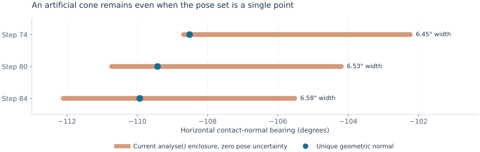
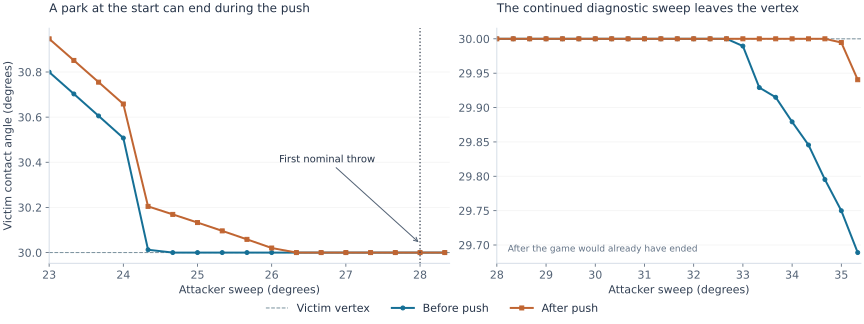

# Tau: the vertex dwell and the missing throw proof

Review of Brief 3 · 18 September 2026 · PR #18 at `2d39d4d53855a9a1aeb86e2674a35ec0aef0e8da`

**The vertex really does simplify the contact calculation. There is also a concrete source of avoidable width in the checker: it retains interior-contact normals even when only the vertex contact is possible. But the proposed shortcut—one parked regime from step 74 through the rest of the sweep—is false on the nominal trajectory.** Some pushes start at the vertex and finish off it.

The practical next step is to make contact regimes conditional on their geometric feasibility, use the exact vertex projection where those conditions hold, and retain the possible transitions during a push. This review supplies the formulas and tests for that change. It does **not** claim a completed interval certificate for the initial pose box.

## Index

1. [Which source and which claims](#source)
2. [Why the second crossing inflates the enclosure](#crossing)
3. [Exact vertex contact and its uncertainty](#formula)
4. [When the park is valid](#guards)
5. [Persistence across a push and through a sweep](#persistence)
6. [What changes on the true arc](#smooth)
7. [Implementation order and reproduction](#implementation)

<a id="source"></a>
## 1. Which source and which claims

I inspected the actual [616-line checker on PR #18](https://github.com/liaminhawai-cmd/Tau/blob/2d39d4d53855a9a1aeb86e2674a35ec0aef0e8da/nn/throw-cert.js), its contact-law module, and the game code extracted from `index.html`. All eleven downloaded source files were checked against their Git blob hashes. The diagnostic scripts add exports and observation callbacks in memory; the repository was not changed.

The original seed is:

```text
blue: (-27.3934, -36.4088, 1.2052)
red:  (-11.7593, -23.2838, 2.9442)
```

First apply blue's 8° swing about foot 0 in direction +1. Then red attacks about foot 0 in direction −1, with a 46° limit. Angles in poses are radians; reported sweep angles are degrees. This report uses **138 substeps of exactly ⅓°**, matching `throw-cert.js`. “Before” means after advancing the attacker for that substep but before pushing the victim. “After” means after the full push solver.

I accept the corrections to the earlier review: Lemmas A and B are branch-local, the checker already retains both tied chord rectangles, and the enclosure basis does not degenerate at `rn = 0`. The earlier tied-branch counterexample remains a warning about global smoothness; it does not establish that this checker drops the other branch. The obsolete material-point overshoot estimate has been replaced in the inspected source.

The new explainer update concerns a different branch, [`claude/nn-arena-matches-tm1hi9`](https://github.com/liaminhawai-cmd/Tau/tree/claude/nn-arena-matches-tm1hi9). I confirmed that `nn/forced-win.js` and `nn/contact-law.js` exist there and were absent from `main` when checked. They also exist on PR #18. The named branch currently resolves to [`5217e4b8`](https://github.com/liaminhawai-cmd/Tau/commit/5217e4b89272c93ec55226d1ea1ee3f553cecba0), whose latest change saves playoff training rows; it has advanced beyond the commit described in the message. The Claude artifact could not be retrieved, so this review checks the code and the pasted update, not the artifact's full wording. Explaining a search verdict does not discharge the remaining interval-proof obligations.

<a id="crossing"></a>
## 2. Why the second crossing inflates the enclosure

**The near-simultaneous feature changes matter, but approaching a chord endpoint does not make Lemma A's strong-convexity constant blow up.** For two nonparallel fixed chords parameterized by arclength, the squared-distance Hessian is constant:

```text
H = 2 [[1, −a·b], [−a·b, 1]]
μ = 2(1 − |a·b|) > 0.
```

The same strong-convexity/variational-inequality argument applies on the closed parameter rectangle, including its boundary. What changes near a corner is which constraints are active. The bound becomes poor when the chords approach parallelism or its input uncertainty is large, not merely because the minimizer reaches an endpoint.

At the first attacker crossing, the victim contact is well inside its chord. At the second, attacker-branch competition and the victim's endpoint condition enter the same small neighborhood. In the checker's actual ⅓° trace, step 73 already has victim angle **30.0124178°**, only **0.005002u** along the chord from the 30° vertex. This agrees with the later coordinator correction. Comparing it with step 73 of a 139-step trace mixes different physical angles; the discrepancy is material at this transition.

### A source-level cause that survives shrinking the box

In `analyse()`, each retained chord rectangle contributes candidate vertex regimes when an endpoint might be active. But the code then **unconditionally appends the interior/interior regime**, using the normal perpendicular to both chord tangents. It does so twice; the duplicate does not widen the hull further, but the impossible interior regime does.

A rectangle can remain a valid candidate because its minimum is at its endpoint. That does not make its unconstrained interior normal feasible. At a strict vertex minimum, the two adjacent victim rectangles describe the same physical contact, with one normal.

For the **single exact pose before step 74**, the result is:

| Quantity | Actual vertex geometry | Current `analyse()` enclosure |
|---|---:|---:|
| Horizontal normal bearing | −108.5113656° | −108.6817498° to −102.2341703° |
| Horizontal fraction `hf` | 0.5524476 | 0.4429345 to 0.5560959 |
| Lever scalar `rn` | +0.5694232u | −0.6950432u to +0.6037184u |

There is **zero pose uncertainty** in this test. The 6.4476° bearing width is therefore an avoidable overestimate, not unavoidable variation across that pose set. The true normal is included, so this is a tightness defect, not an under-enclosure demonstrated by this example.



The ±0.001u run reproduces the failure at step 73, “push cone did not settle.” Its incoming analysis already has eight regime entries and a bearing interval about 14.82° wide. During attempted closure the geometric padding grows from about 0.0271u to more than 0.14u. The fictitious interior choices feed this feedback. This identifies a concrete contributor; it does not prove that removing it alone closes the full run.

**Entering the park regime early is valid only on the subset satisfying its endpoint inequalities.** At the nominal pre-step-73 pose, those inequalities fail. Replacing the whole set by a parked contact would exclude a real trajectory. Introduce the vertex candidate early, but keep the feasible interior candidates and their guards.

<a id="formula"></a>
## 3. Exact vertex contact and its uncertainty

Let the attacker chord have endpoints `A₀, A₁`, length `ℓ`, and unit direction `a`. Let `Id` denote the 3×3 identity, reserving `I` for the body's rotational inertia. For victim leg 0 at vertex angle `φᵥ = 30°`, define:

```text
ρ = R sin φᵥ = R/2 = 11.5475u
p(q) = (x + ρ cos θ, y + ρ sin θ, R cos φᵥ)
a = (A₁ − A₀)/ℓ
s(q) = a·(p(q) − A₀)
Q = Id − aaᵀ.
```

When `0 < s < ℓ`, the attacker contact is interior and everything follows directly:

```text
pₐ = A₀ + s a
w = p − pₐ = Q(p − A₀)
d = |w|                         closest-point distance
n₃ = w/d                        3-D unit normal, attacker → victim
hf = |w_xy|/d
nₕ = w_xy/|w_xy|                horizontal unit normal
r = ρ(cos θ, sin θ)
rn = rₓ nₕ,y − rᵧ nₕ,x.
```

These are exact functions of the pose. They eliminate the victim contact-location unknown and solve the attacker's projection explicitly. **They do not eliminate pose uncertainty:** `r` still rotates with `θ`, and `rn` varies with both `r` and the normal. Keeping `r = ρ eθ` directly avoids the artificial translation uncertainty produced by subtracting independent contact-point and hub boxes.

For an attacker endpoint, replace `s` by `clamp(s,0,ℓ)`. That remains an exact point-to-segment formula, with a different active constraint to track.

### Replacement for Lemma B

Hold the attacker chord fixed during the solver substep. Suppose the material vertex lies within distance `δᵥ` of its reference location. For a pose box with half-widths `hₓ, hᵧ, Θ`, one sufficient radius is:

```text
δᵥ = √(hₓ² + hᵧ²) + 2ρ sin(Θ/2),     0 ≤ Θ ≤ π.
```

Because `Q` is an orthogonal projection,

```text
|Δs| ≤ δᵥ,
|Δw| = |Q Δp| ≤ δᵥ.
```

**The vector error is δᵥ, not 2δᵥ.** The displacement of the projected point is correlated with the vertex displacement. For a clamped projection onto a fixed segment, the residual map `p − projection(p)` is also nonexpansive. One proof uses the projection inequality `Δp·Δprojection ≥ |Δprojection|²` and expands the squared residual difference.

Let `d₀ = |w₀|` and `h₀ = |w₀,xy| = d₀ hf₀`. A ball of radius `δᵥ < d₀` around `w₀` subtends a 3-D angular half-width `α`; its horizontal projection subtends half-width `β` when `δᵥ < h₀`:

```text
α ≤ asin(δᵥ/d₀)
β ≤ asin(δᵥ/h₀)
|n₃ − n₃,₀| ≤ 2 sin(α/2)
|hf − hf₀| ≤ 2 sin(α/2).
```

These follow by the tangent from the origin to the respective displacement ball. Evaluate the exact projected interval or use an ellipsoid if the carried set is anisotropic; the ball formulas are simple sufficient bounds.

For the question's **radius** `δᵥ = 0.024u`, `d₀ = 2.88u`, and `hf₀ = 0.554`:

| Bound | Half-width | Full width |
|---|---:|---:|
| 3-D normal angle | 0.4775° | 0.9549° |
| Horizontal bearing | 0.8619° | 1.7238° |

At the actual pre-step-74 distance 2.82646u, the bearing half-width is about 0.881°. These bounds are conditional on the vertex being the selected contact. If 0.024u denotes a diameter rather than a radius, use 0.012u instead. As the set shrinks to a point, these widths go to zero.

For `|Δθ| ≤ Θ`, a convenient lever bound is:

```text
|Δrn| ≤ ρ(Θ + β).
```

It follows by adding the change in `r` at fixed horizontal normal and the change in the normal at fixed `r`; each unit-vector chord is at most its angle. The exact joint expression for `rn` will often give a tighter interval.

### A sharper vertex overshoot estimate

The same simplification removes the crossing-angle denominator from the Hessian estimate. Use mass coordinates `z = (x, y, √I θ)` and let `dᵥ(z)` be the distance from this material vertex to the fixed attacker segment. Put:

```text
pᵥ = √(1 + ρ²/I)
Mᵥ = pᵥ²/d_min + ρ/I,
```

where `dᵥ ≥ d_min > 0` along the update path. Then `|∇²_z dᵥ| ≤ Mᵥ` on smooth pieces, with the same gradient-Lipschitz bound through segment endpoint clamping.

To see this for an interior projection, write `w = Q(p − A₀)`. The Hessian is the sum of `Dpᵀ Q(Id − n₃n₃ᵀ)Q Dp / d` and the contraction of `n₃` with the second derivative of `p`. Their norms are at most `pᵥ²/d_min` and `ρ/I`. On a clamped piece use `Q = Id`; at the clamping boundary the distance gradient agrees from either side. This gives the same bound along a path that crosses that boundary.

If a solver update starts at a genuine vertex contact and uses the uncapped Newton law, with penetration `p₀ = D − dᵥ` and mass-gradient norm `m`, the first-order term cancels:

```text
m = hf √(1 + rn²/I)
|dᵥ(z_next) − D| ≤ Mᵥ p₀²/(2m²).
```

**For the upper overshoot bound, the victim need not remain the closest vertex after this update.** The global curve distance at the new pose is at most `dᵥ(z_next)`, because this material vertex is still an available point on the curve. Consequently the displayed right side bounds the global distance above `D`. A lower bound of `D` still needs the solver's termination condition; this argument supplies no lower separation guarantee and no total displacement bound by itself.

For example, step 74 has `m ≈ 0.55269`, mass-step length 0.09688u, and the self-contained lower bound `d_min = d₀ − pᵥ p₀/m ≈ 2.71360u`. This gives `Mᵥ ≈ 0.53105/u` and a one-update upper overshoot bound of **0.002492u**. The measured global overshoot after that substep is 0.00032549u. This is a branch-specific improvement, not a substitute for treating every later solver update and competing contact correctly.

<a id="guards"></a>
## 4. When the park is valid

Let `b₋` and `b₊` be the unit victim-chord directions immediately before and after the vertex, both pointing toward increasing arc angle. With `w` pointing from attacker to victim, the local vertex conditions are:

```text
0 ≤ s ≤ ℓ,
w·b₋ ≤ 0,
w·b₊ ≥ 0.
```

If the vector is defined in the opposite direction, `v = −w`, this is exactly the brief's `v·b₋ ≥ 0 ≥ v·b₊`.

**Why sufficient locally:** squared distance is a convex quadratic on each of the two chord rectangles. The attacker derivative is zero at its interior projection. On the preceding victim chord, the vertex is the upper endpoint, so its derivative must be nonpositive. On the following chord it is the lower endpoint, so its derivative must be nonnegative. These are the convex constrained-minimum conditions on both rectangles.

For a whole pose set, compute outward-rounded interval enclosures and require:

```text
lower(s) ≥ 0,       upper(s) ≤ ℓ,
upper(w·b₋) ≤ 0,    lower(w·b₊) ≥ 0.
```

Use strict projection margins to certify an interior attacker point. Equality at a victim inequality can be included in both adjacent regimes without losing coverage.

These tests establish the winner on the two adjacent rectangles, **not over the entire nonconvex polyline**. Other attacker/victim chord rectangles still need exclusion or comparison. Other leg pairs and hub contacts still need the checker's usual treatment.

A simple global comparison is available when every victim material point moves by at most `δ_all`: every fixed chord-pair distance changes by at most `δ_all`. If a competing pair has reference distance `dⱼ,₀`, then

```text
dⱼ,₀ − dᵥ,₀ > δ_all + δᵥ
```

excludes it throughout the set. Exclude the two representations of the same vertex from this competitor test. Near the attacker crossing this test can be too weak; a correlated difference-of-distances enclosure or subdivision may be needed.

### A cheap sufficient margin test

If `|Δp| ≤ δᵥ` and `|Δθ| ≤ Θ`, put:

```text
ν = 2 sin(Θ/2)
e = δᵥ + d₀ν.
```

Then `|Δ(w·b)| ≤ e`: expand the difference as `Δw·b(q) + w₀·Δb`. Thus these four scalar checks suffice locally:

```text
s₀ − δᵥ ≥ 0,                 s₀ + δᵥ ≤ ℓ,
w₀·b₋,₀ + e ≤ 0,            w₀·b₊,₀ − e ≥ 0.
```

At pre-step 74 the positive-side normalized margin is only `n₃·b₊ = 0.00430967`, or **0.01218u** before normalization. A generic 0.024u displacement radius does not certify that inequality. This test's failure is inconclusive about a thinner, suitably oriented set; it is not evidence that every such set contains nonparked poses.

Later the margins improve. For the illustrative bounds `δᵥ ≤ 0.024u`, `δ_all ≤ 0.024u`, and `Θ ≤ 0.024/R`, the scalar tests and all other **leg-0/chord-pair** distance comparisons are positive at both the before and after poses of steps 82–84. This is a useful local check. Those endpoint neighborhoods have not been proved to contain all intermediate solver states or all trajectories from the initial box.

<a id="persistence"></a>
## 5. Persistence across a push and through a sweep

**“Parked before the push” and “parked throughout the push” are different statements.** The nominal trace already separates them:

| Step | Sweep | Victim contact before push | Victim contact after push |
|---:|---:|---:|---:|
| 73 | 24.3333° | 30.0124178° | 30.2045873° |
| 74 | 24.6667° | **30.0000000°** | 30.1691077° |
| 76 | 25.3333° | **30.0000000°** | 30.0961108° |
| 78 | 26.0000° | **30.0000000°** | 30.0201996° |
| 79 | 26.3333° | **30.0000000°** | **30.0000000°** |
| 84 | 28.0000° | **30.0000000°** | **30.0000000°** |
| 98 | 32.6667° | **30.0000000°** | **30.0000000°** |
| 99 | 33.0000° | 29.9894468° | **30.0000000°** |
| 105 | 35.0000° | 29.7498725° | 29.9945994° |

The before-push vertex run lasts steps **74–98**, while the after-push run lasts **79–104**. There are later reentries in the extended diagnostic sweep. It is not one park through 46°. The game would already end at the first nominal throw, step **84 = 28°**, where the exposed foot reaches radius 67.193435u against the 67.167u rim. Values after that are a continued geometry diagnostic, not additional legal game play.



This was checked against `resolvePush` extracted from the pinned game's `index.html`, not only the checker replica: across all 138 supplied attacker poses and corresponding incoming victim poses, the largest discrepancy in `(x,y,Rθ)` was **8.8 × 10⁻¹⁵u**.

The sign test exposes the first departure directly. At step 74:

```text
before:  n₃·b₋ = −0.1262037,    n₃·b₊ = +0.0043097
after:   n₃·b₋ = −0.1502589,    n₃·b₊ = −0.0200228
```

The after values here evaluate the vertex-projection candidate; its second inequality fails, so the true closest point moves into the following victim chord.

### A sufficient persistence certificate

For one fixed-attacker update, enclose the pose path

```text
c(t) = c + t λ nₕ,
θ(t) = θ + t λ rn/I,           0 ≤ t ≤ 1,
```

for every incoming pose and every allowed update value. Certify the projection, both vertex inequalities, and all competing-pair exclusions on that entire enclosure. This ensures the vertex model holds along the update, and supplies the domain needed for any derivative bound using that model. If the checker only needs to identify discrete contact queries, test their complete reachable sets; endpoint checks still cannot justify an unstated derivative bound between them.

Across multiple updates and attacker substeps, the domain must include attacker angle too: `A₀(α)`, `a(α)`, the victim tube of reachable poses, and all Gauss–Seidel intermediate states. A single interval certificate on that joint domain is sufficient. If too wide, subdivide the sweep parameter or carry a tube around its reference trajectory. An endpoint-only argument is possible if the required sign monotonicity has itself been proved; observing that `hf` decreases and `rn` increases does not prove the two endpoint inequalities stay valid.

For this seed, a certificate asserting persistence from step 74 across its first push cannot succeed because the assertion is false even at the center. Treat the vertex-to-interior transition there. The favorable sustained park later in the approach may still be exploitable.

There is no need to prove a park until 46° to prove this throw. Once the **lower bound over every surviving reachable set** puts an exposed foot beyond the rim, the throw proof can stop. The nominal crossing at 28° identifies where to look; its 0.0264u margin alone does not certify the whole box.

<a id="smooth"></a>
## 6. What changes on the true arc

An interior point on a smooth quarter circle has one tangent, so it has no finite vertex normal wedge. Under a unique nondegenerate closest-pair solution, its contact parameters vary smoothly with pose. The generic polyline dwell at exactly 30° disappears. Special symmetric configurations could keep the same smooth material point active, but the vertex mechanism is absent.

The approximation scale is unfavorable for a transfer based only on sagitta:

```text
Δφ = π/24                     one of 12 chord spans
ℓ = 2R sin(Δφ/2) = 3.02097054u
h = R(1 − cos(Δφ/2)) = 0.04944817u.
```

Each arc/polyline pair is within Hausdorff distance `h`. By the triangle inequality, the minimum distance between two curves changes by at most **2h = 0.09889634u** when both are replaced. This bound exceeds the 0.024u set radius by a factor of about 4.1. Comparing a shared material vertex against only the attacker's arc improves the distance bound to `h`; it still exceeds that radius.

Small distance error also does not imply comparably small normal or push error. A numerical smooth-arc minimization at the **same fixed poses** illustrates this:

| Before step | Polyline victim angle | Smooth victim angle | 3-D normal difference |
|---:|---:|---:|---:|
| 74 | 30.0000° | 30.6096° | 5.6787° |
| 80 | 30.0000° | 30.3858° | 4.0741° |
| 84 | 30.0000° | 30.2205° | 2.9691° |

These are numerical stationary minima found from a 7×7 start grid; they are illustrative computations, not certified global root isolation or a simulation of the smooth game's trajectory. At step 74 the distance differs by only about 0.000507u while the normal differs by 5.68°. That is why a distance-only transfer is insufficient for the push law.

A rigorous transfer needs contact-branch isolation, derivative/conditioning bounds, and a bound on the accumulated pose error under the two update maps. For example, on domains where a suitable map Lipschitz bound and one-step model discrepancy have been established:

```text
Eₖ₊₁ ≤ Lₖ Eₖ + εₖ.
```

Here `E` can use the pose norm `√(|Δc|² + R²Δθ²)`. A foot's displacement is then at most `|Δc| + R|Δθ| ≤ √2 E`. A terminal radial margin larger than `√2 E` transfers a throw. The earlier tied-branch example prevents assuming one finite global `Lₖ` for the implemented contact selector across every tie; such locations need separate treatment or set-valued enclosures.

The available data do not yet give an error budget closing that argument. Increasing the discretization to 24 or 48 chords would reduce `h` to 0.0123654u or 0.00309154u respectively, but would change the engine being certified. For the existing 12-chord game, the exact vertex calculation and guarded transitions are the more direct route.

<a id="implementation"></a>
## 7. Implementation order and reproduction

The next checker revision has a concrete order:

1. **Distinguish candidate rectangles from feasible contact regimes.** Keep both tied rectangles where required. Add interval tests for their interior and endpoint conditions; omit an interior/interior normal only after excluding that regime throughout the relevant set.
2. **Give a physical vertex one identity.** The end of victim chord 3 and start of chord 4 are the same vertex. Merge duplicate representations of that contact, retaining the proper attacker-segment identity.
3. **Use the exact projection and rotating lever.** Replace the victim-vertex `2*pad` estimate with the projected displacement bound. Avoid independently subtracting the uncertain hub from the uncertain material-point location.
4. **Retain actual transitions.** Steps 73–78 require interior/vertex possibilities during updates. If distinct branches survive, carry their guarded reachable sets until a common enclosure is tight enough. The current code branches inside a substep and then takes a hull again; merely adding more candidate entries can reproduce the inflation.
5. **Stop at a certified throw.** Test the foot-radius lower bound after each completed enclosure, rather than demanding successful propagation to the entire 46° limit.

Those are implementation recommendations, not a claim that a particular unfinished variant passes. Directed rounding, finite solver termination over the whole set, and coverage of all surviving regimes remain proof obligations. The attached diagnostic formula code uses ordinary floating point and is deliberately not presented as a formal interval implementation.

The reproduction package includes the seed, all 138 before/after geometries, the failing closure diagnostics, engine comparisons, vertex formula checks, smooth-arc comparison, and plotting code. Source files can be obtained from a local checkout or GitHub using the pinned manifest. Nothing needs to be merged or deployed to reproduce these results.

```sh
python fetch-sources.py --checkout /path/to/Tau
node diagnose.js
node checks.js
python smooth-arc.py
python figures.py
```

`checks.js` also exercises the projection and angular bounds on three 9×9×9 pose grids, 2,187 poses total, with no numerical violations. The inequalities above are supported by the derivations; the grids check the implementation rather than proving unsampled containment.

**Result:** a reproducible enclosure defect, exact vertex formulas, sufficient local and global branch tests, and a counterexample to the proposed persistence shortcut. A full machine-checked throw from a nonzero initial box remains unfinished.
