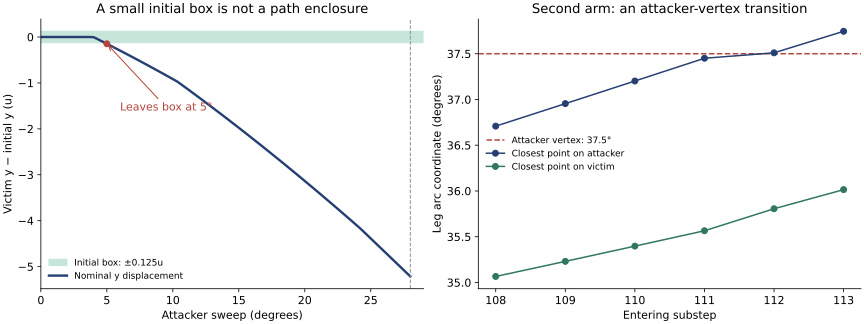

# Tau’s box-size gap: what is proved, what breaks, and what to try next

**Review of Brief 4 and `nn/throw-cert.js` at `1cf90f63fb597c039d99ff554242a12ff4b91f1a`.** The checker has useful new geometry, but its small-box `certified` output is not yet justified by its enclosure argument. I reproduced a rotation-unit mismatch and found two concrete errors in the park linearisation. Separately, the proposed fixed small invariant box fails even for the centre trajectory.

There is a constructive result: outward-rounded local calculations give **positive attacker advance and radial gain over boxes of ±0.125u in position and ±0.01 rad in rotation** at three park slabs. A derivative of the complete contact correction also captures the strong contraction that the direction-only calculation misses. Neither result, by itself, certifies the complete throw from that initial box.

The reviewed checker’s Git blob is `b8fb4c6f3bc69beedd8b8973e96994d65dc2c96a`. It was unchanged at PR #18 head `1ba97f2a9b7bf169c40972fa9476b10c77c3ee13` when checked for this review; the explanatory document had advanced. All numerical findings below are tied to the pinned checker, not future branch heads.

## Index

1. [Reproducing the claim and its units](#reproduction)
2. [Two errors in the enclosure calculation](#defects)
3. [Why the fixed small box cannot be invariant](#invariance)
4. [Actual local bounds for H2 and H3](#slabs)
5. [The full correlated contact update](#full-map)
6. [A finite-step radial barrier](#barrier)
7. [The second arm’s different contact transition](#second-arm)
8. [A moving tube that could close the proof](#moving-tube)
9. [What the size gap does and does not establish](#gap)
10. [Reproduction and remaining obligations](#reproduce)

<a id="reproduction"></a>
## 1. Reproducing the claim and its units

The seed is `ndpxhts24`, after the victim’s 8° reply. `pieces.json` supplies the exact decimal inputs. Attacker 1 rotates clockwise around foot 0 or foot 2; exposed victim foot 1 is tested against radius 67.167u. The search calls one degree at a time, giving three equal ⅓° substeps per call. This schedule matters: one call for the whole swing would run a different finite computation.

The CLI explicitly accepts `hRotDeg`, and converts it using `hr = +args[6] * DEG`. The reported small-box output is reproducible with **±0.002 degrees**, not the brief’s ±0.002 radians.

| Initial position half-width | Rotation half-width | Foot-0 arm: checker output | Foot-2 arm: checker output |
| --- | --- | --- | --- |
| 0.0002u | 0.002° | `certified`, k85, radius lower bound 67.192689 | `certified`, k112, lower bound 67.204663 |
| 0.0002u | 0.002 rad | Exception at k11: `post` is null | Refused at k78 |
| 0.0003u | 0.003° | Refused at k85 | `certified`, k112, lower bound 67.202951 |
| 0.001u | 0.01° | Refused at k74 | Refused at k113 |

These are **program outputs**, not endorsed certificates. The null exception is reporting code reached when every state takes the no-push branch; it does not demonstrate a dynamical failure.

The sampling grid scales the rotation axis as Rθ. Thus the first row’s metric half-widths are approximately `(0.0002, 0.0002, 0.00080613)u`. Against a cell with half-width 0.125u on all three metric axes, the subdivision ratios are approximately **625, 625 and 155**, a product of 6.06×10⁷. The order-of-magnitude subdivision concern survives, but the ratio is not 625 on every axis.

The park timing correction in the brief is right: pre-push vertex contact spans k74–98, post-push contact k79–104. Their intersection contains the nominal first throw at k84. Those endpoint observations do not prove that every internal solver correction stays in that regime.

<a id="defects"></a>
## 2. Two errors in the enclosure calculation

### 2.1 The park Jacobian differentiates the wrong attacker chord

`parkJacobian` selects a chord with:

```js
segClosest3(A[a], A[a + 1], p, p)
```

For this implementation of `segClosest3`, placing the degenerate point segment second returns the first segment’s start rather than its perpendicular projection. The selector chooses the nearest chord start. During the studied park it selects chord **2**, although the actual perpendicular foot is on chord **1**. The point-first call is:

```js
segClosest3(p, p, A[a], A[a + 1])
```

Here is one derivative entry, ∂nₓ/∂x, evaluated at singleton pre-push poses:

| Substep | Current `parkJacobian` | Derivative for the actual chord |
| --- | ---: | ---: |
| 74 | 0.203529327768 | 0.124912560021 |
| 80 | 0.225863204514 | 0.141048778664 |
| 84 | 0.242915167672 | 0.153818090129 |

The chord mismatch also occurs at k79, 85 and 95. At a singleton, a derivative interval for the wrong function cannot justify the mean-value enclosure for the real contact direction. This is an incorrect enclosure premise, not merely an overestimate of its width.

### 2.2 A carried basis no longer satisfies m₃ = a꜀

Let a꜀ be the current centre push direction, M the carried frame, m₃ its third column, B the direction Jacobian, and N = Id + Λ꜀B. In this identity λ = Λ − Λ꜀ is the variation in total push magnitude. The code preserves a well-conditioned frame across substeps using `st.keep`, but later uses the identity

```text
λ a꜀ = λ N m₃ − λ Λ꜀ B m₃.
```

The right side is **λm₃**. It equals the left side only when the third column still equals the current direction. Measured in `(x,y,Rθ)` coordinates, the norm of m₃ − a꜀ is 0 at k73, 0.02361 at k74, 0.05022 at k75 and 0.16927 at k79; its maximum before the reported certificate is about 0.39458.

The frame-independent identity is

```text
λ a꜀ = λ N m₃ + λ(a꜀ − m₃ − Λ꜀ B m₃).
```

The missing term is λ(a꜀ − m₃). The nonlinear fallback’s assignment of the magnitude variation to coefficient 3 has the same assumption. Alternatively, carry the actual coordinates of a꜀ in the new frame, or differentiate the complete correction as in section 5.

An in-memory diagnostic changing only chord selection returns `certified` at k84 for the smallest degree-labelled box. Adding the missing frame term makes that run refuse at k83 because two leg pairs become possible. These are useful ablations, **not a repaired formal checker**. They show that the reported small-box result depends on the disputed bookkeeping. They do not exhibit a pose that escapes the throw.

The remaining proof must also cover direction derivatives along all internal corrections, all feasible contact transitions, and the finite solver’s residual for every pose. A Jacobian on the pre-push box alone does not automatically bound an average of directions along a multi-correction path.

<a id="invariance"></a>
## 3. Why the fixed small box cannot be invariant

Interpret B literally as a box centred on the initial victim pose with half-widths `(0.1u, 0.1u, 0.01 rad)`. Its centre trajectory leaves B at **k15, a 5° sweep**, with displacement

```text
Δx = +0.058073207546u
Δy = −0.147474534319u
Δθ = −0.003303968478 rad.
```

Its outermost foot is then at 64.046910u, still on the board. The same witness leaves the ±0.125u box. Just before the nominal throw, after k83, the y displacement is −5.123380u and the angular displacement is −0.0459191 rad.

Therefore H4 is false for that **fixed** small box, independently of how tightly derivatives are bounded. The initial uncertainty width is not the distance the body travels. A narrow set travelling with the trajectory, or a long curved region containing it, is a different and viable proposal.



H4 also needs consistent push units. For horizontal separation demand s and hub slide λ,

```text
λ = s / (1 + rₙ²/I),       ω = λ rₙ/I.
|ω| ≤ s/(2√I),             |ω| ≤ (R/I)λ.
```

The constant 1/(2√I) ≈ 0.02588 bounds spin **per unit s**, not per unit λ. A bound in terms of accumulated hub-slide length needs L/I if |rₙ| ≤ L. The distinction matters on the second arm, whose lever arm is much larger.

<a id="slabs"></a>
## 4. Actual local bounds for H2 and H3

I implemented an outward-rounded enclosure of the real polyline geometry in `slab-bounds.py`. For each row below, the victim pose ranges over a box centred on the nominal pose **entering** that substep, with half-widths **±0.125u, ±0.125u, ±0.01 rad**. The attacker angle ranges over the entire indicated ⅓° slab.

Let n be the horizontal unit normal from attacker to victim, u the exposed foot’s radial unit vector, f its leg direction, and J a counterclockwise quarter-turn. Then

```text
g = n·u + (rₙ/I) R (Jf)·u.
νₕ = (−J(pₐ − pivot))·n          [clockwise attacker advance per radian]
ν₃ = h_f νₕ                     [3D distance closing per radian].
```

The displayed lower bounds are rounded down from the saved interval endpoints; the lever bounds are rounded up.

| Substep | Attacker slab | g lower bound | νₕ lower bound, u/rad | ν₃ lower bound, u/rad | Upper bound on \|rₙ\|, u |
| --- | --- | ---: | ---: | ---: | ---: |
| 74 | 24⅓°–24⅔° | 0.45049 | 11.30605 | 5.14508 | 4.02593 |
| 80 | 26⅓°–26⅔° | 0.34377 | 10.03130 | 4.76986 | 5.19592 |
| 84 | 27⅔°–28° | 0.27072 | 9.01490 | 4.50484 | 5.94572 |

These are useful local H2/H3 bounds at the requested uncertainty scale. They are **not** bounds over the entire contact window, a proof that the trajectories enter these boxes, or an exclusion of other leg/hub contacts. In particular, these independent boxes cannot simply be summed into a throw certificate.

The computation partitions the four-dimensional domain into 256 subboxes. It enumerates all 144 chord pairs for attacker leg 0 and victim leg 0 and their interior/endpoint active constraints. A candidate is discarded only by an interval projection/KKT test or because a verified distance lower bound exceeds an upper bound supplied by an admissible point pair. Every remaining minimiser contributes to the result. This avoids assuming that a whole box remains on the centre’s vertex.

Arithmetic endpoints are rounded outward with `nextafter`; sine and cosine use interval Taylor polynomials and a derivative remainder bound, followed by a Lipschitz enclosure over the input interval. This establishes bounds for the stated **real-geometry model with the supplied binary64 constants**. It does not enclose every rounded instruction or branch comparison in the game engine. Ordinary floating-point grid checks are included as diagnostics, separately from this interval calculation.

The same coarse calculation at k20 and k50 is inconclusive for g. A negative interval lower endpoint there is **not a negative-g witness**. The grazing approach and the full moving tube still need work.

<a id="full-map"></a>
## 5. The full correlated contact update

Use mass coordinates z = `(x,y,√I θ)`. On one smooth closest-feature branch, let G(z) = d(z) − D, a = ∇G, S = aᵀa and H = ∇²G. For an active contact with no denominator floor, cap or deep-overlap switch, one actual correction is

```text
Φ(z) = z − G a/S.
```

Differentiating the **whole correction**, including its magnitude, gives

```text
DΦ = Id − aaᵀ/S − (G/S)H + (2G/S²) a(aᵀH)
   = (Id − eeᵀ) + (G/S)(2eeᵀ − Id)H,    e = a/√S.
```

Since `2eeᵀ − Id` is an orthogonal reflection,

```text
‖DΦ − (Id − eeᵀ)‖ ≤ |G| ‖H‖ / S.
```

At G = 0 the active-branch derivative is a tangent-plane projection: the normal error is removed to first order. A calculation retaining only `Id + Λ꜀B`, with B the direction derivative, misses the magnitude derivative that supplies this contraction. There is no need to bound λ and the direction variation as independent intervals first.

For one smooth branch on a convex enclosing domain, a mean-value inclusion is

```text
Φ(z꜀ + e) ∈ Φ(z꜀) + J꜀e + ([J] − J꜀)e,
```

where `[J]` encloses DΦ throughout that domain. A centred form, affine arithmetic or a Taylor model can retain the remaining dependencies. A third-derivative bound is optional; an interval enclosure of this explicit Jacobian is sufficient for the displayed formula.

`contact-map.js` implements second-order automatic differentiation of the interior/interior, victim-vertex and attacker-vertex distance formulas. Its full-update Jacobian agrees with centred finite differences to below 3×10⁻¹⁰ at the four tested park poses. These floating-point checks validate the formula implementation locally; they are not uniform interval bounds.

| Substep | Singular values of one correction’s Jacobian, mass coordinates |
| --- | --- |
| 74 | 1.011866, 1.002025, 0.037938 |
| 80 | 1.013382, 1.002059, 0.040853 |
| 84 | 1.014629, 1.002080, 0.042934 |

There is strong normal contraction and slight tangent expansion. This does not assert contraction in every direction, nor establish a whole-cell certificate.

Two implementation consequences matter. First, at G = 0 this Jacobian is rank deficient: blindly replacing M by J꜀M and then inverting it is unsafe. Retain two tangent generators plus a bounded gap coordinate, or use a suitable invertible outer frame. Second, the engine applies a **finite composition of piecewise corrections**, not one correction with an averaged direction. Compose the maps for the actual passes, including the free identity branch, endpoint transitions and any reachable floor/cap branch. Distinct global minima can select different finite updates; preserve those branches rather than applying a mean-value theorem across a jump.

<a id="barrier"></a>
## 6. A finite-step radial barrier

### Finite radial gain needs a rotational remainder

For one push let the exposed foot be F = c + Rf, radius r = \|F\|, radial unit u = F/r, and rotation ω = λrₙ/I. Convexity of the norm and the rotation Taylor bound give

```text
r_next − r ≥ u·(F_next − F)
           ≥ λg − (R/2)ω²
           = λ[g − Rλrₙ²/(2I²)].
```

Thus if g ≥ g_min, |rₙ| ≤ L and λ ≤ λ_max, a sufficient finite-step coefficient is

```text
γ = g_min − R λ_max L²/(2I²) > 0,
r_next − r ≥ γλ.
```

No extra negative quadratic remainder from the radial norm is necessary. Its support-plane inequality already has the useful sign. Conversely, `λg` alone is an infinitesimal expression, not an exact finite gain.

Near first grazing, λ can approach zero even if g and attacker closing speed have positive lower bounds. Consequently a uniform positive **gain per substep** need not exist. Nondecrease permits zero gain while the pieces are free.

### Attacker advance is not automatically penetration

Freeze q while the attacker moves from Aₖ₋₁ to Aₖ, and define the exact closing amount

```text
Cₖ(q) = d(Aₖ₋₁,q) − d(Aₖ,q).
σ = d(Aₖ₋₁,q) − D.
p = max(Cₖ(q) − σ, 0).
```

The first correction has λ = p/[h_f(1+rₙ²/I)] on the uncapped, unfloored branch. Previous clearance, first-contact timing and overshoot all matter. Replacing p by an instantaneous attacker velocity times a step, without integrating and accounting for σ, is not a proof.

### A slab sum can charge clearance once

There is a useful non-stepping progress argument. Use the same designated leg-pair distance dₖ throughout a slab, while allowing its closest features to change. Write

```text
gₖ = dₖ(qₖ) − D,
Cₖ = dₖ₋₁(qₖ₋₁) − dₖ(qₖ₋₁),
δₖ = dₖ(qₖ) − dₖ(qₖ₋₁).
```

Here gₖ denotes the gap, not the radial coefficient g above. Direct telescoping yields

```text
Σδₖ = ΣCₖ + g_end − g_start.
```

Suppose every actual push in the slab satisfies radial gain ≥ γλ, and its contribution to the designated distance opening is at most b₊λ. The latter follows by integrating a verified directional derivative bound along each finite update, including every crossed feature branch. Then κ = γ/b₊ gives

```text
Δr_slab ≥ κ (Σ C_lower − g_start_upper − ε_end)
```

if g_end ≥ −ε_end. Monotonicity, when separately established, permits replacing a negative right side by zero. Sum these bounds with slab-specific κ values. This charges the slab’s initial clearance/overshoot once, instead of subtracting an unrelated worst-case penalty at every substep.

The result is conditional on a verified reachable tube, the stated push bounds, and the finite solver’s end-gap bound. Running ten passes at the centre does not establish that bound for every pose. Likewise, a blanket refusal of all ten-pass executions is unnecessary if their residual can be bounded directly.

<a id="second-arm"></a>
## 7. The second arm’s different contact transition

For attacker foot 2, the principal leg pair is **(attacker 1, victim 0)**. The centre approaches an **attacker** vertex at arc angle 37.5°, while the victim contact remains in a chord interior.

| Entering substep | Attacker arc coordinate | Victim arc coordinate | Centre contact |
| --- | ---: | ---: | --- |
| 108 | 36.70870° | 35.06584° | Interior/interior |
| 109 | 36.95472° | 35.23084° | Interior/interior |
| 110 | 37.20204° | 35.39737° | Interior/interior |
| 111 | 37.45066° | 35.56544° | Interior/interior, very close to attacker vertex |
| 112 | 37.51010° | 35.80609° | Next attacker chord; nominal throw |

At k109, the selected chord pair (4,4) has distance 2.745098267u; the adjacent attacker-clamped candidate (5,4) has distance 2.752669881u, only 0.007571614u farther away. At k111 the difference is about 0.000062208u. The uncertain set can admit the adjacent feature before the centre reaches it.

The centre’s singleton bearing interval at k109 has **zero width**. For the carried ±0.001u/±0.01° run, the pre-k109 interval is only about 0.106° wide; the reported 5.32° growth is in the **post-k109** analysis. Pre-k110 already admits an attacker endpoint and adjacent interior branches, with a bearing hull about 4.23° wide. By k113 the inflated set admits additional victim-vertex branches too.

So this is not the first arm’s victim-vertex dwell. It is uncertainty near an attacker-vertex transition, amplified by the endpoint enclosure and subsequent wrapping. The present special Jacobian runs only for a known victim vertex. The corresponding attacker-vertex map uses a fixed attacker point and its perpendicular projection onto a moving victim chord; its explicit branch formula is included in `contact-map.js`.

Both arms can use a common family of exact feature maps and verified transition guards. Fixing only the victim-vertex special case does not cover the second obstruction.

<a id="moving-tube"></a>
## 8. A moving tube that could close the proof

Choose a reference path q̄ₖ and sets Sₖ = q̄ₖ + PₖE **in advance**. Instead of recursively inflating the previous hull, verify the actual finite engine map Tₖ against those sets:

```text
B_initial ⊂ S₀,
Tₖ(Sₖ₋₁ ∩ onboard) ⊂ Sₖ ∪ {thrown}.
```

This is invariance of a phase-indexed tube. It accommodates five units of travel while keeping uncertainty narrow. Choosing q̄ₖ from a nominal trajectory is fine; that trajectory alone does not verify the inclusions.

For a centred error map in tube coordinates, a sufficient box inclusion has the form

```text
|cᵢ| + Σⱼ sup|Jᵢⱼ| bⱼ + remainderᵢ ≤ bᵢ.
```

An ellipsoid, zonotope or contact-coordinate tube may preserve correlations better. In particular, use exposed-foot polar coordinates `(r,ψ)` and orientation θ, so

```text
c = r u(ψ) − R f(θ).
G = d − D,         ∂G/∂r = h_f n·u.
```

Where this derivative has a verified positive lower bound, the implicit function theorem solves the contact shell as `r = r(α,ψ,θ,σ)`, with σ = G. A narrow interval for the residual σ then represents normal uncertainty directly; the other coordinates carry tangential uncertainty. Verify that the finite solver returns to this shell and that ψ, θ stay within the chosen bounds. Use separate coordinate patches and guarded unions at feature changes.

This is a concrete formulation of H4 that can be checked. It is not yet a completed inclusion proof for the ±0.125u initial box.

<a id="gap"></a>
## 9. What the size gap does and does not establish

The observed size limit does **not** establish a representation-independent threshold. In particular:

- A recurrence `pad + c pad²` was not derived uniformly for the current piecewise checker. Nonzero growth from a zero-width input already shows a source of intrinsic enclosure slack.
- The swept direction hull contains variation along a correction path even at a single starting pose; that variation need not shrink quadratically with the initial box width.
- The complete map’s magnitude derivative supplies a first-order contraction absent from the direction-only update. Changing that representation changes the recurrence itself.
- The two verified implementation errors must be repaired before measuring the valid checker’s limiting size.

It remains possible that a particular interval representation performs poorly at ±0.125u. The present experiments do not prove impossibility, nor justify a promise that the full-map method will close the whole cell. The most useful next target is a verified moving tube through first contact, the stable park and the second arm’s attacker-vertex transition.

<a id="reproduce"></a>
## 10. Reproduction and remaining obligations

`README.md` gives the commands. `source-manifest.json` pins seven source files by Git blob hash; `fetch-sources.py` restores them without changing a checkout. Instrumentation and the two diagnostic edits are applied **in memory**. No game or production checker file is changed by this package.

| Evidence | Files | Status |
| --- | --- | --- |
| Checker outputs, units, kept-frame mismatch | `probe.js`, `baseline.json` | Reproduced floating-point executions |
| Wrong chord and derivative entry | `jacobian-segments.json`, `map-checks.json` | Concrete code/geometry defect |
| Complete-map derivative and finite radial inequality | Sections 5–6 | Analytical identities/conditional bounds |
| Full-map formula implementation | `contact-map.js`, `map-checks.js` | AD and finite-difference diagnostics |
| Wide local park slabs | `slab-bounds.py`, `slab-bounds-step*.json` | Outward-rounded local real-geometry enclosures |
| Fixed-box exit and attacker-vertex transition | `reference-poses.json`, `second-arm.json` | Reproduced nominal witnesses |
| Whole-cell throw | — | **Open** |

The remaining certificate needs initial legality; uniform exclusion or handling of other contacts and engine guards; coverage of every reachable closest-feature branch; a finite-pass residual bound; verified tube inclusion; and enough accumulated finite radial gain to cross the rim. A certificate of the actual floating-point program additionally needs explicit rounding/branch error control or a proved correspondence with the real model.

The brief’s `park-monotone.js` and its sample output were not available among the supplied files or the pinned tree. Its 200-pose results are therefore treated as supplied empirical evidence, not independently reproduced volume-wide bounds. No conclusion here depends on accepting those samples as proof.

Source links: [pinned checker](https://github.com/liaminhawai-cmd/Tau/blob/1cf90f63fb597c039d99ff554242a12ff4b91f1a/nn/throw-cert.js), [pinned lemma write-up](https://github.com/liaminhawai-cmd/Tau/blob/1cf90f63fb597c039d99ff554242a12ff4b91f1a/nn/THROW-CONTACT-LEMMAS.md), [search and grid implementation](https://github.com/liaminhawai-cmd/Tau/blob/1cf90f63fb597c039d99ff554242a12ff4b91f1a/nn/forced-win.js), [PR #18](https://github.com/liaminhawai-cmd/Tau/pull/18).
