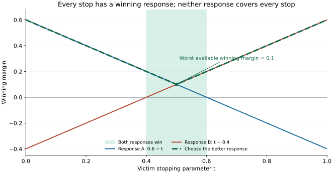

# Tau: from dead points to regions

**Brief 5 review · 19 September 2026**

The new corpus is useful evidence for generalisation. Its strongest negative
conclusions do not follow, however: **the published L17 implementation never
loads the new corpus, and the 63 claimed balls have positive six-dimensional
volume.** The zero-hit match therefore does not test those balls or rule out
lookup as a playing mechanism.

The constructive answer is a **finite cover of the victim's legal replies by
verified winning responses**. Different responses may cover overlapping parts
of a region. Below is a sufficient condition, a quantitative way to bridge a
reply gap and grow an initial-pose radius, and the correct induction for deeper
forced wins. These are mathematical statements with explicit hypotheses.
This review has not verified those hypotheses over a new nonempty Tau region.

## Index

1. [What was actually measured](#measurement)
2. [The balls are full-dimensional](#volume)
3. [What the corpus does and does not establish](#corpus)
4. [A sufficient condition over a region](#region)
5. [A quantitative bridge between winning responses](#bridge)
6. [Moving tubes and event boundaries](#tubes)
7. [The right induction: forced win within n moves](#induction)
8. [Concrete prediction and implementation order](#next)
9. [Sources and reproduction](#sources)

<a id="measurement"></a>
## 1. What was actually measured

The [measurement report](https://github.com/liaminhawai-cmd/Tau/blob/b9907b05e40103dc459d3013b7a873ac12941f78/docs/dead-regions/l11-dead-measured.md)
records L17 beating L11 by 56–40, with 23,804 table consultations and no hits.
I inspected the index, Node loader and arena at the commit publishing that
report, and at the later Brief 5 snapshot. Those three blobs are identical
between the two revisions.

The [embedded table](https://github.com/liaminhawai-cmd/Tau/blob/b9907b05e40103dc459d3013b7a873ac12941f78/index.html)
contains the following:

| Quantity | Published L17 table | New research files |
| --- | --- | --- |
| Point entries | 4 old `dead` and 4 old `win2` entries | 261 sampled dead points |
| Region/family entries | 12 old entry arcs | 63 sampled joint-pose balls |
| Lookup radius | 1u, or 1.5u for one old entry | 0.009–0.350u |
| Loaded by `nn/engine.js` | Constants extracted from `index.html` | Neither JSONL file is loaded |

None of the 63 new centres exactly matches an embedded entry; none lies inside
an old `dead` entry's lookup radius. The radii of 1–1.5u are what the runtime
uses, **not a finding that these radii are mathematically justified**.

The reported 2.85u is also a different quantity from the one Brief 5 needs.
`nearestVictim` measures one piece's distance to eligible embedded point
entries. It is not the minimum joint-pose distance to the 63 new balls, and it
does not measure distance to their boundaries. `nearestJoint` is updated only
after the first-piece radius gate passes; the arena prints `nearestVictim`.
Comparing 2.85u with the new maximum radius 0.35u mixes different tables and
different measurements.

**Supported conclusion:** the old table produced no recorded scoring hits in
this run. The published code does not support saying that the new corpus was
tested and missed. Raw match traces and a runtime artifact hash were not
supplied, so this is an audit of the committed experiment, not a reconstruction
of an unrecorded working tree.

The score is inconclusive about strength, not evidence against every large
gain. The reported 95% interval, −11 to +133 Elo, includes zero and +100. A
claim that a “big margin” is ruled out needs a specified threshold and an
appropriate interval. Openings, colour pairing and dependence also matter.
Likewise, dense-test and guard counters show that those mechanisms ran; they
do not isolate their causal effect. Use ablations and an equal-time baseline.
The reported 81 seconds/game under six-way contention is not by itself a
per-move cost ratio against L11.

<a id="volume"></a>
## 2. The balls are full-dimensional

Fixing the attacker while varying the victim gives a 3D slice of joint pose
space. That earlier observation is correct. It does **not** describe
`certifyStar`, which perturbs all six pose coordinates: three for each piece.
The [corpus README](https://github.com/liaminhawai-cmd/Tau/blob/c1ac39e771f8115797a4b8672587860fb676ad1b/docs/dead-regions/README.md)
actually says this correctly, contradicting the zero-volume argument in Brief 5.

In scaled coordinates z = (bx, by, Rθb, rx, ry, Rθr), the implemented metric is

```text
d(z,z₀) = ‖Δbxy‖₂ + |RΔθb| + ‖Δrxy‖₂ + |RΔθr|.
```

This is a sum of two Euclidean translation norms and two absolute rotation
coordinates. For a local angular chart, its radius-ε ball has ambient volume

```text
Vol₆(Bε) = (π²/45) ε⁶ > 0,  for ε > 0.
```

Derivation: use polar coordinates for the two translations, and split each
rotation coordinate into its positive and negative half. The Jacobian factor
is 16π² r₁r₂. Integrating over r₁+s₁+r₂+s₂ ≤ ε gives
16π²ε⁶/720. In unscaled angle coordinates, divide by R².

For the 63 reported radii, the sum of individual ambient volumes is
**0.00184559 u⁶** in scaled coordinates. This is an upper bound on their union
before board clipping and overlap accounting. It is not a fraction of actual
play, nor a proved volume of dead positions: the deadness claims remain sampled.

A concrete example makes the dimensional distinction visible. The largest
reported ball has ε = 0.35 and centre

```text
blue: (−38.6035, 24.5839, −2.8424 radians)
red:  (−29.1648, 14.0727,  3.6549 radians)
```

Moving blue's y by +0.0875u and red's x by +0.0875u changes **both** pieces and
has distance 0.175u, inside the claimed ball. This demonstrates membership in
the defined set; it is not an independent proof that the perturbed pose is dead.

### Two metric details matter for the next checker

`randomInBall` samples a coordinate L1 cross-polytope inside the actual metric
ball. Its support occupies **4/π² ≈ 40.5%** of the latter's ambient volume.
Thus the current random sampler never visits the remaining approximately
59.5%. The source acknowledges an inward bias; this is the size of the support
difference, not merely a nonuniform density over the whole ball.

Also, the dual norm for a gradient is

```text
max(‖∇bxy f‖₂, |∂Rθb f|, ‖∇rxy f‖₂, |∂Rθr f|).
```

A maximum over six coordinate slopes is not the dual norm of this metric.
For example, f = bx+by has coordinate derivatives at most 1 but changes by
√2ε at a translation (ε/√2, ε/√2), whose metric length is ε. Even rigorously
bounded coordinate derivatives must be combined in the correct norm.
Three times *observed* slopes still supplies no uniform derivative bound;
adding a √2 factor alone would not make the sampled method a proof.

<a id="corpus"></a>
## 3. What the corpus does and does not establish

The [reproducible audit](audit.json) confirms the file accounting:

| Recorded quantity | Count |
| --- | ---: |
| Sampled dead points | 261 |
| Sampled dead balls | 63 |
| Point falsification trials / agreements | 10,440 / 10,440 |
| Ball pose trials reported | 1,575, all recorded as agreeing |
| Uncertified controls | 1,045 |
| `escape`, including 865 screen-only rejections | 909 |
| `unresolved` | 136 |
| Points using ordinary slivers | 104 |
| Points using engine-probed slivers | 117 |
| Points using either kind | 177 |

These are counts in the saved records; this review did not repeat all those
trials. A label `escape` is not an exhibited safe continuation, and random
agreement is not universal coverage. Even the 84 points with neither sliver
kind still depend on sampled allowances.

There are clearly separated sampled-dead examples: the largest clearance is
17.1026u at `u6nehpcuw-1`, as reported. The literal count “10 strictly apart”
needs a tolerance: using `CL.minGapOf − CL.MIND` gives 10 above **0.05u**, but
187 above zero, including tiny residuals. This clearance function includes hub
clearance adjustments, so it is not solely a nearest-leg measurement. The
data support separated *sampled-dead* examples; they do not prove that contact
is unnecessary for true deadness until at least one such example is proved.

The tested scalar features and a few conjunctions are insufficient classifiers.
That does not rule out static geometric classes. Reachable sets and response
envelopes are themselves functions of the initial state and rules. The 1,045
controls are unknowns selected by the screen, not verified negatives. A sound
new region containing one of them may be a discovery rather than a false
positive. Report agreement with the old labels separately from actual
counterexamples; split validation by source game to reduce related-position
leakage.

### The repeated failure string is not a diagnosis

All 136 unresolved rows contain “no single arc certifies the gap”. But
`deadCertificate` appends “the throw changes arm here” whenever its preceding
checks fail, without testing whether the winning arm changed. Possible causes
include small margins, signature disagreement, the empirical allowance,
record snapping, or a failed engine probe. One message does not establish one
physical cause, and in particular does not establish a substep-phase event.

The 132 attempts / 67 accepted / 65 refused figures are reported in the README;
the raw attempt logs and full star graphs are not in the inspected tree.
The 63 summary rows cannot independently identify every refusal's cause.
Even a genuine event change somewhere in a tested box does not imply its
centre lies exactly on the event boundary.

Reproduction also needs a small correction: the pinned `star-drive.js` hardcodes
`[0.35, 0.25, 0.175, 0.125, 0.08, 0.05]` and never reads `STAR_HS`.
The README's `STAR_HS=0.3,0.12,0.05` command therefore does not select that
ladder in this version. Recorded h values include 0.3 and 0.12; preserve the
historical driver or logs needed to reproduce those passes.

<a id="region"></a>
## 4. A sufficient condition over a region

Call the threatened side V and the other side A. A Tau move is represented by
a pivot foot, direction and legal stopping parameter. There are six pivot and
direction pairs, called arms. The formulation below uses the chosen move
protocol; if variable drag batching or reversals are allowed, include those
inputs too, or explicitly restrict the claim.

Let Q be a region of valid initial states with V to move. A state includes
whatever the engine needs beyond the six poses: side, ko or other history,
pending rule state, and a specified execution protocol. Write Fβ(q,t) for
the state after V's legal reply on arm β at stop t. Its legal domain is

```text
Dβ = {(q,t): q ∈ Q, t is a legal stop on arm β from q}.
```

For each β, construct finitely many guarded patches Cβj covering Dβ.
Each patch carries a legal response policy πβj and a verified positive lower
bound on its winning margin. A policy may depend on the observed post-reply
state; it must prescribe actions the engine can actually execute.

**Region criterion.** Assume every nonterminal q in Q has a legal victim move
(otherwise apply the actual no-move rule). Suppose (i) no legal victim reply wins for V, (ii) every
nonterminal reply lies in at least one patch, and (iii) that patch's response
provably wins for A, including legality and any intermediate terminal checks.
Then every q in Q is dead within one victim move and one attacker move.
Replies that already lose for V are covered by their terminal outcome.

**Proof.** Choose any q and any legal victim reply. Its terminal outcome either
already wins for A or it lies in a covering patch. The patch provides A's
winning response. Both choices were arbitrary, giving ∀q ∀reply ∃response.

The usable certificate is the finite patch data: domains, coverage checks,
response policies, guard bounds and lower margins. Offline verification does
the expensive work. Online membership can be a few inequalities locating q
inside a verified initial region, followed by the stored response selection.
The 261 examples can propose patch templates; their labels do not verify them.

For margins Mj that genuinely certify legal wins, the desired structure is

```text
inf over legal (q,t) [ max over available responses j Mj(q,t) ] > 0.
```

Requiring one common response throughout a whole patch instead asks for
`max_j inf_(q,t) Mj(q,t) > 0`, which is stronger. The existing checker already
allows different arms across subdivided gaps; the missing step is rigorous
coverage at the final unresolved gap and across initial poses, rather than
an empirical sliver shortcut.

<a id="bridge"></a>
## 5. A quantitative bridge between winning responses

Here is a directly implementable sufficient condition. On a reply interval
[t₀,t₁], suppose response a has margin at least mL > 0 at t₀, response b has
margin at least mR > 0 at t₁, and verified Lipschitz bounds along the full
composed reply-and-response maps are BL, BR > 0. Both responses must be legal
where they are used. Then

```text
Ma(t) ≥ mL − BL(t−t₀),       Mb(t) ≥ mR − BR(t₁−t).
```

The left and right winning intervals overlap whenever

```text
mL/BL + mR/BR > t₁−t₀.                         (bridge)
```

This strict inequality proves every stop has a winning response. The lower
envelopes are straight lines, so a finite interval-cover calculation suffices.
More than two responses or more endpoints give the same kind of finite cover.
Zero Lipschitz constants are handled as constant lower bounds.

For example, on [0,1] take Ma(t)=0.6−t and Mb(t)=t−0.4. Neither response wins
throughout the interval: each has minimum −0.4. Nevertheless their maximum is
at least 0.1, with overlap (0.4,0.6). There is no contact or phase switch in
this example. Failure of a single common response is not evidence for either.



### Turn the bridge into a six-dimensional initial region

Let q₀ be a reference pose and r = d(q,q₀). Suppose AL and AR bound the change
in the two endpoint margins with respect to the **correct joint-pose metric**,
uniformly over a guarded neighbourhood. Then replace the endpoint bounds by
`mL−ALr` and `mR−ARr`. The bridge holds for every q satisfying

```text
mL − ALr > 0,    mR − ARr > 0,
(mL−ALr)/BL + (mR−ARr)/BR > Δt.
```

When the denominator is positive, the last condition gives the explicit radius

```text
r < (mL/BL + mR/BR − Δt) / (AL/BL + AR/BR).
```

Also cap r by the endpoint positivity radii, the verified guard neighbourhood
and the radius over which the legal-reply cover remains valid. Apply this to
all covered intervals on all six arms; the smallest permitted radius gives a
sufficient initial ball. Use strict slack or an explicit positive safety
margin, not equality at a zero-margin boundary.

As a synthetic numerical example, mL=mR=0.6, BL=BR=1, Δt=1, AL=2 and AR=1
permit r < 1/15. At r=0.05 the endpoint lower bounds are 0.5 and 0.55; their
winning intervals overlap by 0.05, and the worst lower margin is 0.025.
These numbers illustrate the formula; they are not measured Tau constants.

The outstanding Tau work is to bound these constants or lower envelopes for
the **complete finite program**, including contact and stop branches. Observed
finite differences cannot substitute for these hypotheses. A derivative jump
can be handled with a common verified Lipschitz bound; an actual discontinuity
needs separate guarded patches and explicit boundary handling.

<a id="tubes"></a>
## 6. Moving tubes and event boundaries

Two different issues must be separated.

**An initial region straddles an event boundary.** Split it into guarded event
cells, or enclose all feasible branches and verify their union. If two events
both truly stop the move, their minimum can remain continuous as their order
swaps. A refusal is not a proof of discontinuity, and shrinking finitely many
boxes does not prove their centre lies exactly on a boundary.

**A trajectory leaves its initial box.** Brief 4 demonstrated this for the
particular fixed small boxes at k15. A moving enclosure follows the path and
can stay narrow. That result does not rule out every larger fixed enclosure,
nor prove that the 65 new star refusals have the same cause.

For a region Q, a suitable certificate carries phase-indexed sets Sk enclosing
both pieces and all necessary rule state. With Tk the actual substep update,
the obligations have the form

```text
S₀ contains Q,
Tk(Sk−1 ∩ nonterminal, allowed inputs) ⊆ Sk ∪ verified winning terminals.
```

All losing terminals must be excluded; at the end, every remaining state must
be in a verified winning response region or satisfy the throw condition.
Guarded splits retain every feasible contact feature, stopping event and input
phase. If initial uncertainty includes both pieces, the attacker cannot be
silently fixed while propagating the victim's box.

The execution schedule needs its own pin. The engine's 1° calls use ⅓°
substeps, but the replica's `swing` divides an entire requested arc into equal
steps no larger than 0.4°. `replyFamily` uses that whole-arc record, while
`sampleAt` snaps upward to its next stored step. Those are different maps.
A proof for one schedule is not automatically a proof for arbitrary dragging.
An observed phase tolerance remains an empirical check.

<a id="induction"></a>
## 7. The right induction: forced win within n moves

For a fixed attacking side A, let W₀ contain terminal A wins. On nonterminal
states define the monotone bounded-horizon construction:

```text
Wn+1 = Wn
     ∪ {A to move: some legal move has all allowed outcomes in Wn}
     ∪ {V to move: legal moves are nonempty and every legal move
                   has all allowed outcomes in Wn}.
```

For a deterministic engine there is one outcome per fully specified move.
Set-valued outcomes allow certified uncertainty, including input schedules
when required. Actual terminal and no-move rules must be applied explicitly;
an empty move set is not a free universal-quantifier win.

Induction proves that Wn contains only states from which A can force a win
within n plies. The present one-victim-move/one-throw certificates aim at a
subset of **W₂**. The miner's `k=0` is an offset from the recorded final throw,
not the zero-horizon set W₀.

This is the right object to grow by predecessor operations. A certificate can
be a finite graph of regions with a decreasing remaining-ply rank. Circular
claims such as “R wins because it reaches R” are insufficient. “Closed” here
means stable under the appropriate game operation, not necessarily a
topologically closed subset: strict throw margins naturally produce open
conditions. In an infinite state/action space, the union of finite Wn is the
finite-uniform-horizon attractor; do not assume it equals every conceivable
eventual-win state without an additional boundedness argument.

<a id="next"></a>
## 8. Concrete prediction and implementation order

The first unresolved control gives a useful regression case:

```text
game: arena7dd3b1us-1; red to move
pose: [8.3707, −25.3453, −1.1528, 16.1925, −34.7032, 3.7508]
victim arm: (pivot 1, direction +1)
reported unresolved gap: 4.8–5.2 degrees
```

With the documented frozen engine, at each of the nine stops
4.80, 4.85, …, 5.20 degrees, the victim has **not** thrown the attacker, and
the **same attacker arm (1,+1)** throws the victim; the other five tested arms
do not. This is saved in [gap-probe.json](gap-probe.json). The victim uses
one-degree calls plus a final remainder, as in the falsification routine.

The replica behaves differently: requests through 5.15° snap to 5.153153°,
and 5.20° snaps to 5.549550°. These probes expose why rounded failure labels
and sampled records need careful interpretation. Nine successful stops do
not resolve the whole interval, and the rounded endpoints are not a replay
of every internal gap sample. The precise prediction is the nine listed
engine results, not a new universal deadness claim.

The next implementation should proceed in this order:

1. **Make the experiment identify its inputs.** Log rule/index hash, loaded
   corpus hash, counts, radii, call schedule and full joint distance. Check
   lookups at known centres before playing games. Re-run any lookup experiment
   with the corpus it claims to test, preserving its sampled status.
2. **Save the evidence needed for region construction.** Keep full star
   graphs, all 13 probe profiles, legal-reply bounds, branch guards, selected
   response intervals, exact stops and refusal logs. The current summary rows
   are seeds for this work, not complete proof certificates.
3. **Implement the interval cover and verified tube bounds.** Start with one
   reference seed and one reply gap. Export certified endpoint margins and
   slope/enclosure bounds, then check the bridge inequalities. Extend to all
   six arms and a positive joint-pose radius before claiming a dead region.
4. **Evaluate two separate outcomes.** For geometry, report coverage and
   agreement on the old labelled corpus, newly covered unknowns, and actual
   falsifications. For playing strength, compare L11, table-only, dense-only,
   guard-only and combined versions under matched openings and equal budgets.

The research target remains worthwhile: a compact family of verified reply
covers could give both a mathematical class and a cheap playing mechanism.
The present data neither establish that class nor rule out its usefulness.

<a id="sources"></a>
## 9. Sources and reproduction

- [Brief 5 and corpus snapshot](https://github.com/liaminhawai-cmd/Tau/tree/c1ac39e771f8115797a4b8672587860fb676ad1b/docs/dead-regions): `c1ac39e771f8115797a4b8672587860fb676ad1b`.
- [Search implementation](https://github.com/liaminhawai-cmd/Tau/blob/c1ac39e771f8115797a4b8672587860fb676ad1b/nn/forced-win.js): blob `7ac62262c268a2e86f199a1fe88f241a5665319c`.
- [Published L17 implementation](https://github.com/liaminhawai-cmd/Tau/blob/b9907b05e40103dc459d3013b7a873ac12941f78/index.html): index blob `1d36f9ba6d6032d739f5e22b0a71608b520429b3`.
- [Frozen corpus rule source](https://github.com/liaminhawai-cmd/Tau/blob/5252f2d839b739f52ce69158dcddfcedbd62bbb7/index.html): blob `729a394959968e5fbdb5af10d3067005712b890f`.
- [Source manifest](source-manifest.json), [reproduction instructions](README.md), [dataset audit](audit.js), [engine diagnostic](gap-probe.js).

The frozen loader receives only an in-memory export of `crossingSubstep`,
matching the documented corpus setup. No engine rule body is changed. The
metric-volume calculation, dual norm, response-cover criterion and induction
are derivations in this review. Corpus labels and match outcomes are reported
data; the nine-stop diagnostic is an ordinary floating-point reproduction.
