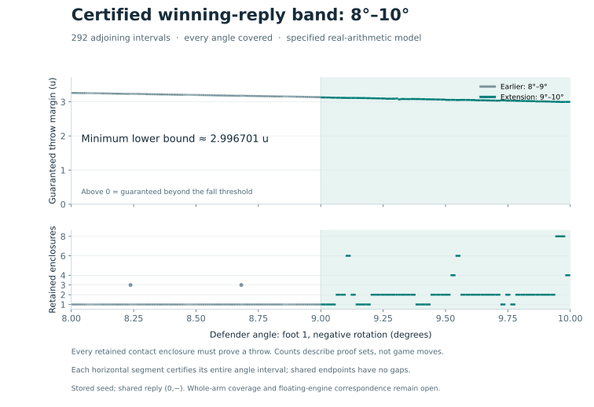

# Extending the certified reply band to 8°–10°

**3 October 2026: the complete continuous cover now reaches 10°.** Every
defender angle from 8° to 10° on arm (1,−) has the prescribed legal winning
reply in the specified real-arithmetic model. The 9°–10° extension passed
full replay, and the two bands join without a gap at 9°.

| Quantity | Earlier 8°–9° | New 9°–10° | Joined 8°–10° |
| --- | ---: | ---: | ---: |
| Adjoining interval cells | 240 | 52 | 292 |
| Minimum certified throw margin, u | 3.137016072573885 | 2.9967010273719406 | 2.9967010273719406 |
| Minimum certified ko hub displacement, u | 6.643456718172017 | 6.292656220879101 | 6.292656220879101 |
| Maximum final enclosures per cell | 3 | 8 | 8 |
| Decimal trajectory cases | 724 | 236 | 960 |
| Decimal coordinate containment checks | 267,156 | 87,084 | 354,240 |
| Decimal containment failures | 0 | 0 | 0 |

The new verifier used Python 3.12.14 and Node v24.19.0 and freshly replayed
all 52 cells; no prior verification checkpoints were reused. The 236 new
trajectory cases use 185 distinct angles because adjoining cells share
endpoints. These finite checks validate the implementation; the interval
enclosures establish continuous coverage.



The complete result is recorded in `arm1-eight-ten-certificate.json`. It
nominally doubles the width of the preceding 8°–9° result. It does not complete
the whole arm or the whole lost-position theorem.

## Exact scope

This continues [the completed 8°–9° band](ARM1-ONE-DEGREE.md). The stored Brief 6
seed, engine pin, real geometry, source-ordered contact program, arithmetic
assumptions and reply schedule are identical. All six enclosure source files,
including the branch adapter, are unchanged.

The defender rotates about its original foot 1 in the negative direction
through α degrees. The attacker is still at its original stored pose, as
established by the earlier no-contact certificate on this arm. The attacker
then pins foot 0 and uses the prescribed negative reply at β_k = 0.375k degrees,
k = 1,…,123. The ten-pass contact program is enclosed at each accepted pose.

The shared [crossing and stopping certificate](ARM1-CROSSING.md) remains
applicable because it depends only on the attacker path. Every defender
endpoint enclosure must separately establish a throw and displacement beyond
the 0.25u ko threshold. Every initial defender pose must be on the board.
The joined bands share exactly the endpoint α = 9°.

This is a statement about the exact stored binary64 seed and angle endpoints,
interpreted in the specified real-arithmetic model. Original pose-recording
uncertainty, arbitrary command schedules, uniform JavaScript roundoff bounds,
the remainder of the arm and the other defender arms are outside this result.
The whole lost-position theorem remains open.

## Branch retention throughout the new band

The earlier sweep first used single zonotopes and then separately repaired two
tiny contact-switch gaps. `cover_arm1_branches.py` now uses the exhaustive
branch adapter for every proposed interval. When the enclosure retains several
separated contact images, it follows all of them. A branch is never chosen from
a sampled trajectory, and a difficult branch is never removed to make a cell
pass.

The initial proposal width is 0.02°. Three successful exploratory proposals
are recorded in `arm1-nine-ten-probes.json`; they receive the same full replay
as every subsequently generated cell. The coordinator records failures,
subdivides intervals whose bounds remain unresolved, and saves every accepted,
pending and terminally unresolved interval. These lists must form an exact
partition at every checkpoint. In-flight work stays pending until it completes.

The generator finished with **52 adjoining cells**. The proposals 9.30°–9.32°
and 9.72°–9.74° could not resolve the horizontal-floor guard. Bisecting each
produced two successful cells, leaving no unresolved interval. These were
failures to bound a guard over a whole proposal, not observed losing replies.

| Final enclosures retained per cell | Cells in the new 9°–10° band |
| ---: | ---: |
| 1 | 12 |
| 2 | 34 |
| 4 | 2 |
| 6 | 2 |
| 8 | 2 |

All live enclosures must finish all 123 substeps and prove a positive throw
margin. Unsupported guards or branch-count limits fail the whole proposal.
The proof uses the same exhaustive prefix-tree and state-conservation argument
as the preceding packet. Larger counts of retained enclosures need not mean
that many distinct physical outcomes: some candidates can be infeasible or
nearly coincident. Retaining them is conservative.

## Verification and composition

`check_branch_cover.py` re-executes each accepted interval and compares its full
canonical propagation hash. The hash includes every substep's enclosures and
generators. Every fork must include every child, and every state must survive
to a later state or the final endpoint. Terminal throw and ko bounds are
recomputed from all final pose enclosures.

Independent 80-digit Decimal trajectories check complete poses against one
member of the enclosing union after every substep. Unbranched cells use
endpoints and midpoint; branched cells also use both quarter points. These are
implementation checks. The continuous argument comes from the enclosures and
complete interval partition, not interpolation between sampled successes.

The verifier checkpoints each completed replay with its input-row hash,
canonical propagation hash and source/artifact hashes. Its `--resume` option
can reuse only matching checked inputs and sources. It records any reused
results explicitly. Incomplete verification cannot produce a complete-domain
certificate.

`compose_arm1_bands.py` first rechecks the existing 8°–9° composition against
its pinned artifacts. It then requires a completed 9°–10° validation, recomputes
the new terminal geometry bounds, and verifies the common endpoint and full
8°–10° partition. The composition gate was exercised while the extension was
unfinished and rejected it. It also tests omitted cells, a shifted joining
endpoint and a nonpositive throw margin.

This composition check reads completed replay artifacts; it is not described
as another trajectory replay. The interval replays share the enclosure kernel,
while the Decimal implementation is separate. The packet is not a
machine-checked formal proof or a uniform floating-engine certificate.

## Reproduction

From this directory:

```sh
python check_branch_cover.py
python compose_arm1_bands.py
python plot_arm1_bands.py
```

The first command performs a fresh full replay of the new cover. The second
validates and joins both bands. The figure refuses unfinished or inconsistent
artifacts and draws bounds valid across whole intervals.

The generator can resume its recorded proposal work with:

```sh
python cover_arm1_branches.py
```

For a new generation independent of the three saved proposals, choose a fresh
output name and pass `--seed ''`. Timing fields and proposal bookkeeping are
not expected to reproduce byte for byte; canonical propagation hashes are.

The next research step is further coverage of arm (1,−), using exhaustive
branches where necessary, followed by the other arms and the separate
floating-engine correspondence obligations.
