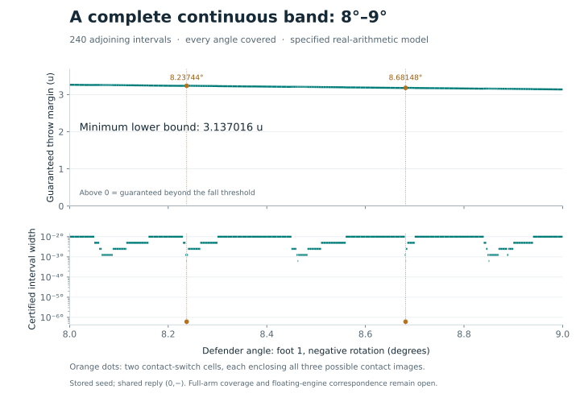

# Closing contact-switch gaps in the 8°–9° band

2 October 2026. **The shared winning reply is now certified for every defender
angle from 8° to 9° on arm (1,−), in the specified real-arithmetic model.**
The 240 closed adjoining cells cover the whole band, including both formerly
unresolved contact-switch intervals. The minimum lower throw margin is
**3.137016072573885u**. This is a nominal tenfold extension of the previous
8°–8.1° band.

The full defender arm, other arms and uniform correspondence with JavaScript
floating-point execution remain open. This is a result about the stored seed
and prescribed reply, not the whole lost-position theorem.



## Statement and scope

This extension uses exactly the stored Brief 6 seed, engine pin,
real geometry, source-ordered contact program and arithmetic assumptions in
[the 8°–8.1° certificate](ARM1-EXPANDED-COVER.md). Defender angle α is its exact
real rotation about original foot 1 in the negative direction. The attacker
starts at the original stored pose, pins foot 0 and follows the prescribed
negative reply at β_k = 0.375k degrees, k = 1,…,123.

The [free-motion certificate](README.md#continuous-real-geometry-results)
keeps the attacker at that original pose during the defender's initial motion.
The [shared crossing and stopping certificate](ARM1-CROSSING.md) depends only
on the attacker path and therefore applies to every interval and every
defender contact branch. Every final branch must separately establish a throw
and a defender-hub displacement above the 0.25u ko threshold. Initial defender
feet must all be inside the board.

The seed and angle endpoints mean their exact stored binary64 values. The
results include no uncertainty in the original four-decimal pose recording.
They are continuous real-model enclosures, not a uniform roundoff bound for
JavaScript execution, a result for arbitrary call schedules, a whole-arm
theorem or a lost-position theorem.

## Two gaps that subdivision did not close

The single-zonotope sweep leaves these intervals unresolved:

| Defender interval, degrees | Attacker substep | Final branches | Verified lower throw margin, u |
| --- | ---: | ---: | ---: |
| [8.23744140625, 8.237442016601562] | 73 | 3 | 3.234773589686412 |
| [8.681480712890624, 8.681481323242185] | 72 | 3 | 3.1791334010025873 |

Each is only about 6.1035×10⁻⁷ degrees wide. Nevertheless, at the first solver
pass of the indicated substep, retained contact images have centres separated
by about 0.0203u and 0.0202u respectively. Repeatedly enclosing them together
creates a much larger set of intermediate poses. The old propagation exceeds
its 1u halfwidth exploration limit on the ninth pass.

Shrinking these cells alone did not resolve that loss of precision. This is
not evidence of an escaping defender. The replacement keeps all three contact
images separately and successfully carries every resulting enclosure through
the complete reply. Two images are very close; neither is discarded as a
duplicate. No exact location or uniqueness theorem for a contact-switch angle
is needed.

The successful branch artifacts are `arm1-gap-branches.json` and
`arm1-gap2-branches.json`. Their checkers reproduce the complete canonical
propagation hashes. Each replay includes five 80-digit Decimal trajectories,
with all three coordinates at every substep contained together in one member
of the union: 1,845 coordinate checks per interval, zero failures. The three
terminal enclosures in each interval also satisfy the stopping/ko requirement.
Their minimum hub displacement bounds are 6.915738738330239u and
6.757762286038958u respectively.

## Why separate branches preserve coverage

`reply_branches.py` reuses all five original enclosure modules unchanged.
Within a solver pass the existing `vunion` call receives a list of candidate
contact images. The ordinary evaluator encloses their union in one jet. The
new adapter can instead replay the same pass once for **every** candidate.
It retains an identity image too, whenever the original evaluator supplied one.

For an incoming enclosure Z, the original candidate construction gives

\[
 F(Z)\subseteq\bigcup_{i=1}^{m} F_i(Z).
\]

Each replay encloses one full candidate extension, without asserting that
the candidate is feasible everywhere in Z. This can overestimate the reachable
set, which is permitted. It cannot remove the candidate selected by an actual
input. At another undecided union, the replay branches again and enumerates
every child. A prefix-tree checker verifies that every child index 0,…,m−1
exists, that no leaf is duplicated and that no disconnected or omitted subtree
is accepted.

The cached geometry remains the geometry at the beginning of that same solver
pass. It is not recomputed halfway through a pass. The existing interval
gradients, auxiliary parameters, coefficient-error bounds and generator
reduction then enclose each resulting image as before. On subsequent passes
and substeps, every live enclosure is propagated separately. A conservation
check tracks branch IDs from the initial state through every fork to the final
states; no state may disappear.

The 1e−4u centre-spread threshold only decides whether to keep a union together
or represent it separately. It never certifies a contact predicate or excludes
a candidate. Both choices enclose all candidates. Branch-count limits,
unsupported guards and enclosure blow-up fail the entire attempt. They never
silently prune an inconvenient branch.

On each of these two intervals there is exactly one three-way fork. All three
enclosures survive to the endpoint and all prove a throw. Thus the branch
argument closes the whole interval, including any contact tie inside it;
the Decimal samples provide an implementation cross-check, not gap coverage.

## Sweep accounting

The ordinary coordinator retained 32 previously certified cells. Its extension
made 326 new attempts: 206 accepted cells and 120 rejected parent or terminal
proposals. There are therefore 238 accepted ordinary cells. The rejected
proposals comprise 86 unresolved horizontal-floor guards and 34 enclosure
halfwidth limits. They are computation outcomes, not observed game losses.
The two branch certificates add two cells, for the verified 240-cell composition.

All rejected nonterminal cells were subdivided. The only two remaining terminal
gaps are exactly the intervals in the table above; there are no pending cells.
The raw sweep's explicit `complete: false` is correct and is retained for
provenance. Completion belongs to the composition after every cell is replayed.

## Verification of the complete band

All 238 ordinary cells were re-executed and matched their complete canonical
propagation hashes. The run resumed from a checkpoint of 93 completed cells;
the second invocation replayed the remaining 145. No cell was accepted solely
because it had succeeded in the generator. Both branch certificates were also
re-executed in full, retaining and checking all three terminal states each.

The final composition has no gaps or pending work. It recomputes every
terminal geometry bound. The minimum defender-hub displacement is
**6.643456718172017u**, comfortably above the 0.25u ko requirement. All initial
defender feet are on the board; the shared attacker crossing and stopping
certificate applies throughout.

The independent 80-digit Decimal checks total **724 trajectory cases** and
**267,156 coordinate containment checks**, with **zero failures**. Ordinary
cells use endpoints and midpoint; each branch cell additionally uses its two
quarter points. Shared endpoints are tested against adjoining enclosures, so
these are not independent statistical observations. Continuous coverage comes
from the enclosures and complete partition, not these sampled checks.

The component and composition checkers passed 12 corruption-control cases,
including omitted cells, omitted branches, a lost terminal state, altered
propagation digests, overlaps and nonpositive margins. The composition gate
also rejected the unfinished ordinary replay before its final checkpoint.
This run used Python 3.12.14 and Node v24.19.0.

`arm1-one-degree-certificate.json` is the complete composed certificate.
`arm1-one-degree-validation.json` describes the fully replayed ordinary cells
only and therefore correctly remains `complete: false` for the whole domain;
its two explicit gaps are closed by the separate branch artifacts. The
composition checker verifies that those domains match exactly.

## Reproducibility and interruption recovery

`extend_arm1_cover.py` retains the 32 previous cells and checkpoints accepted,
pending and unresolved intervals as an exact partition. It now accepts a seed
cover and an initial proposal width, so the same coordinator can extend an
already completed cover. In-flight work remains pending until it finishes.

`check_arm1_extension.py` now checkpoints each successfully replayed leaf too.
The checkpoint records an input-row hash, complete propagation hash and hashes
of the arithmetic sources, Decimal checker and verification program. Explicit
`--resume` checks those hashes before reusing a completed result and records
how many leaves were reused. Omitting it performs a fresh replay. A partial
report lists every unverified, pending and unresolved interval and cannot be
mistaken for a completed domain certificate.

The raw single-zonotope sweep remains marked incomplete when it has the two
contact-switch gaps. It is not relabelled as successful. The separate
`check_arm1_one_degree.py` composes its replayed cells with the two replayed
branch certificates, checking exact shared endpoints and input/source hashes. It also recomputes
the initial on-board, final throw and ko bounds from every archived endpoint
enclosure. Only that composition may declare the entire 8°–9° domain complete.

The full-propagation hashes include every substep's enclosures and generators;
elapsed runtime is excluded. Interval replay shares the propagation kernel.
The Decimal solver is separately implemented. Neither is a machine-checked
formal proof or a proof of floating-engine correspondence.

From this directory, after generating or obtaining the committed artifacts:

```sh
python check_arm1_extension.py --input arm1-one-degree-cover.json --output arm1-one-degree-validation.json --partial
python check_reply_branches.py
python check_reply_branches.py --input arm1-gap2-branches.json --output arm1-gap2-validation.json
python check_arm1_one_degree.py
python plot_arm1_cover.py
```

The first command deliberately allows the raw sweep's explicit gaps. The
composition command rejects them unless the separately replayed certificates
cover exactly those intervals. The figure requires the completed composition;
it draws interval-wide lower bounds and does not interpolate sampled successes.

To regenerate the contact-switch artifacts:

```sh
python reply_branches.py
python reply_branches.py --lo 8.681480712890624 --hi 8.681481323242185 --output arm1-gap2-branches.json
```

The next research target is to extend this exhaustive branch treatment over
the rest of defender arm (1,−), then address the other arms and the separate
engine-roundoff obligations. A wider angle band does not measure the fraction
of the full lost-position proof completed.
