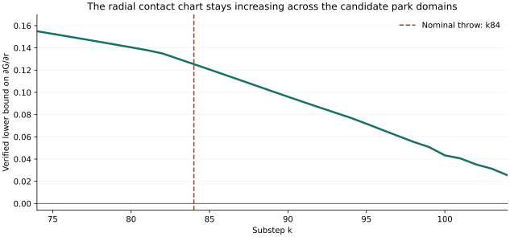

# Brief 7: a usable contact chart, but the tube still needs inclusion

**20 September 2026 · source `18efad5398798b65b477f9af4be17947a358d3ce`.**

The two repairs are present and the reported size sweep reproduces. The new
positive result is that **the exposed-foot radial coordinate stays transverse
to the contact shell across the whole observed park** on explicitly specified
candidate boxes. Outward-rounded bounds give ∂G/∂r > 0.125 through the nominal
throw, and > 0.025 over the longer park/transition range through k104.

This establishes a useful local geometric condition, not a complete moving-tube
proof. The zero-width failure also does not establish that parallelotopes are
intrinsically unsuitable: this checker creates artificial width before the
park. The most useful change is to enclose the complete finite push map while
preserving its correlations; changing the outer shape alone need not help.

## Index

1. [What reproduces and where slack begins](#what-reproduces-and-where-slack-begins)
2. [A positive radial derivative through the park](#a-positive-radial-derivative-through-the-park)
3. [An explicit chart for vertex-on-chord contact](#an-explicit-chart-for-vertex-on-chord-contact)
4. [What a moving tube must actually verify](#what-a-moving-tube-must-actually-verify)
5. [The repair and the remaining fallback assumption](#the-repair-and-the-remaining-fallback-assumption)
6. [The shorter route through arm 2](#the-shorter-route-through-arm-2)
7. [Reproduction and scope](#reproduction-and-scope)

## What reproduces and where slack begins

Using the full-precision post-8°-reply pose from Brief 6, I reproduced all six
initial widths on both arms. The small requested box, ±0.0002u and ±0.002°,
refuses at k83 on arm (0,−1) and returns `CERTIFIED` at k112 on arm (2,−1).
Every smaller tested first-arm box, including a singleton, refuses at k84.
The second arm returns k112 for every tested width. These are program outputs,
not endorsed proof certificates.

The singleton trace gives a more specific diagnosis:

| Event | Arm (0,−1) | Arm (2,−1) |
| --- | ---: | ---: |
| First positive pre-step pad above 10⁻⁸u | k13: 0.000001249u | k76: 0.000105782u |
| Last pre-step pad | k84: 0.145246u | k112: 0.025779u |
| Result | Refused | `CERTIFIED`, lower radius 67.210202u |

The first arm's first actual push is at k12. Its width is already nonzero at
k13, long before the pre-push vertex park at k74. The code introduces a contact
target interval `[D−EPS_LO, D+ETA]`, with `EPS_LO = 10⁻⁷` and an overshoot
allowance depending on penetration. Penetration is nonzero for a single input
pose. Hulling the correction directions and forgetting their dependence on
push magnitude supplies more slack. None of this is initial-state uncertainty.

For an exact deterministic finite map, a singleton has a singleton image.
An enclosure can give a wider answer and still be conservative. Thus this
failure diagnoses this enclosure calculation's precision; it does not prove
that every parallelotope or every recursive propagation must fail. Likewise,
the two corrections invalidating this run do not rule out all first-arm boxes,
other centres, or other verified algorithms.

A moving tube is a suitable framework, but the current algorithm already moves
its centre along the trajectory. The substantive change is a better map bound
and verified inclusion into chosen sets, not merely making the centre move.

## A positive radial derivative through the park

Write exposed victim foot 1 as F = r u(ψ), with u a unit radial vector, and
write the victim hub as

```text
c = r u(ψ) − R f₁(θ).
```

For the distance d between attacker leg 0 and victim leg 0, let G = d−D.
On a smooth closest-feature branch, holding ψ, θ and attacker angle α fixed,

```text
∂G/∂r = h_f n·u.
```

Here n is the unit horizontal contact normal from attacker to victim and h_f
is the horizontal fraction of the three-dimensional normal. This derivative
does **not** include the rotational term in the radial gain of a physical
push: differentiating the chart at fixed θ and following the push law are
different operations.

I extended Brief 4's outward-rounded real-geometry calculation to bound this
derivative over 31 four-dimensional slabs. For each k = 74,…,104, the domain is:

- α from (k−1)/3° to k/3°;
- x and y between the nominal pre- and post-push coordinates, extended by
  0.125u in each direction;
- θ between the nominal pre- and post-push orientations, extended by 0.01 rad.

Every slab is divided into 16 boxes. The calculation enumerates all possible
endpoint/interior minimisers between the two 12-segment legs, retaining every
candidate not excluded by distance bounds and projection conditions. It does
not assume the centre's chord or the parked vertex persists throughout a box.

| Slabs included | Certified lower bound on branch ∂G/∂r |
| --- | ---: |
| k74–84: through the nominal throw | 0.1253727544 |
| k74–98: through the pre-push park | 0.0554763287 |
| k74–104: through the last post-push park step | 0.0254047880 |



These are uniform bounds over the stated domains, not sampled derivatives.
At ties, they apply to each retained active branch; do not replace a
nondifferentiable minimum by a single smooth formula. Along a radial segment
within a domain, a common positive bound gives strict increase of the distance
minimum, including branch changes.

**What this proves:** the proposed chart is not obstructed by a zero radial
derivative on these candidate domains for this leg pair. It gives a local
inverse sensitivity bound, |∂r/∂σ| ≤ 1/m, wherever a contact-shell root exists
and the appropriate branch/one-sided interpretation applies.

**What remains:** root bracketing/existence, reachable-set containment,
exclusion or handling of other leg/hub contacts, and correspondence to the
floating-point engine. These boxes were proposed around a nominal path; I have
not proved the uncertain trajectories remain inside them. Slabs after k84
continue geometry past the nominal throw solely to examine the whole park.
The calculation also does not certify the early path before k74.

## An explicit chart for vertex-on-chord contact

The stable park admits a particularly simple branch formula. Let the fixed
attacker chord at angle α run from A₀ along the unit vector e, with length L.
Let v be the victim's material vertex. In the radial coordinates above,

```text
v − A₀ = r U + b,       U = (cos ψ, sin ψ, 0),
P = Id − e eᵀ.
```

The vector b contains the victim vertex's offset from the exposed foot,
its height, and −A₀. At fixed α, ψ, θ it is independent of r. Define

```text
A = UᵀPU,      B = UᵀPb,      C = bᵀPb.
d² = A r² + 2 B r + C.
```

For contact-shell coordinate σ = d−D, the increasing root is

```text
r = [−B + sqrt(B² − A(C − (D+σ)²))] / A.
```

This formula requires A > 0, D+σ > 0, a positive discriminant and selection
of the increasing branch. It also requires the projection
`s = e·(rU+b)` to lie in [0,L], the victim vertex to satisfy the adjacent-chord
closest-point conditions, and this pair to win against other feasible feature
pairs. Interval root isolation can be preferable to direct evaluation where
the quadratic formula loses numerical precision.

This is an explicit local chart, not an appeal to an unspecified implicit
function. At a feature boundary, keep a guarded union of charts. The vertex
condition itself need not be singular: distance to a segment varies smoothly
inside the vertex's valid projection region. A dwell is not a general reason
to abandon contact coordinates or parallelotopes.

The pair's distance is a minimum over branches, so root existence and global
selection still need a bracket. Positive slope gives uniqueness along a
connected radial bracket that stays in the verified domain; it does not
create a root or justify jumping between disconnected chart pieces.

## What a moving tube must actually verify

For one ordinary leg-contact correction with no cap, deep shove or h_f floor,
write the victim update in `(x,y,θ)` coordinates as

```text
q⁺ = F(q) = q + ℓ(q) a(q),
a = (nₓ, nᵧ, r_n/I),
ℓ = (D−d) / [h_f (1+r_n²/I)].
DF = Id + a (∇ℓ)ᵀ + ℓ Da.
```

The term a(∇ℓ)ᵀ matters: penetration and push direction are correlated. The
direction-only linearisation misses the contraction obtained by correcting
penetration. For C₀ = 1+r_n²/I,

```text
∇ℓ = −∇d/(h_f C₀)
      − ℓ[∇h_f/h_f + 2r_n∇r_n/(I C₀)].
```

Enclose the actual finite sequence of corrections, recomputations and guards,
not an arbitrary average direction with an independently chosen total ℓ.
With reference q̄⁺ = F(q̄), the centred real-map error satisfies

```text
F(q̄+e) − F(q̄) = [integral from 0 to 1 of DF(q̄+t e) dt] e
```

on a guarded smooth domain containing those segments. This is zero at e=0.
Add explicitly bounded numerical errors when comparing to floating execution.
Across branch changes, use branch-aware images or a justified piecewise bound.
This avoids adding a pose-independent contact-shell width at every substep.

Choose Sₖ in advance or from an adaptive proposal, then **verify**, for all
relevant engine state and input phases,

```text
Tₖ(Sₖ₋₁ ∩ nonterminal) ⊆ Sₖ ∪ winning terminal states.
```

The inclusion must also exclude losing terminals. A failed proposal can be
enlarged or split and rechecked; adaptively choosing sets is not itself
unsound. Conversely, a prechosen tube is not automatically tighter than a
recursive enclosure. Both still depend on the quality of the map bound.

In a contact-coordinate tube, enclose tangential variables ψ, θ and the finite
solver's actual residual σ. Prove the residual enclosure for every input;
do not pin σ to zero because the solver nominally settles. An ellipsoid or
zonotope may retain useful correlations, but none removes this obligation.
Guarded unions are required whenever the chosen chart or program branch is
not uniformly valid, independently of the outer set's shape.

## The repair and the remaining fallback assumption

The patched identity is exact:

```text
λa꜀ = λNm₃ + λ(a꜀−m₃−Λ꜀Bm₃),   N = Id + Λ꜀B.
```

I checked that the implementation adds `λ(a_c−m3)` to the remainder before
transforming it by the new inverse basis. The chord selector now uses the
point-first projection. Those two repairs are correct for the identified
defects. They do not validate the derivative domain along every internal
correction or establish any of the remaining global proof obligations.

There is still a **latent assumption in the nonlinear fallback**. It keeps
the current M, adds `Λ−Λ꜀` only to coefficient 3, and sets the contact pinning
direction `mA = a_c`. That is justified only if M's third column equals a꜀.
Usually the rebase establishes this; a carried frame reaching a non-park
branch need not satisfy it.

I instrumented all twelve size/arm runs. None entered that fallback with a
scaled column mismatch above 10⁻¹⁰. Thus this is not the demonstrated cause
of the k84 refusal or a demonstrated defect in the surviving arm's run.
It still needs an invariant or a repair before the checker is generalised.

Two consistent choices are:

- Rebase onto a frame whose third column is a꜀ before using that fallback.
- Keep M, add `(Λ−Λ꜀)(a꜀−m₃)` to its world-coordinate remainder, and use the
  actual third column m₃ for the coefficient-3 contact pin. Correcting only
  the remainder while pinning against a꜀ leaves the coordinate mismatch.

The algebra is conditional on valid intervals for Λ and the correction path.
No frame identity can supply those intervals by itself.

## The shorter route through arm 2

For the narrowly stated goal “prove a throw from this post-reply box”, arm
(2,−1) is the sensible first target. One legal winning arm suffices. Its current
small-box output has bound 67.204662547u at k112, above the 67.167u threshold.
That is an empirical indication of manageable enclosures, not a proof.

It avoids the long victim-vertex park, but it does **not** avoid feature
transitions. Brief 4 identified an attacker-vertex/adjacent-chord competition
near k109–112. The stored exact feature-map work applies, with projection onto
a moving victim chord instead of a fixed attacker chord. Keep both candidates
where their ordering is uncertain.

The minimum complete certificate still needs:

1. Initial legality and a legal attacker sweep under the stated call schedule.
2. Every possible contact branch, and proof that excluded leg/hub contacts,
   cap/floor/deep-shove guards and losing terminals cannot occur.
3. Correct maps for every internal finite solver correction, including the
   attacker-vertex transition.
4. Uniform residual bounds when the solver hits its iteration cap. The current
   centre's tiny last push does not bound all poses in the box.
5. Verified reachable-set inclusion through k112, followed by a uniform exposed
   foot radius above the off-board threshold.
6. Explicit floating-point error/branch correspondence if the theorem is about
   the actual JavaScript program rather than a real-arithmetic model.

A shorter implementation route is to unroll the finite solver using guarded
exact feature maps and a centred full-map enclosure, then use the k112 radius
test directly. It need not prove a separate long-run radial barrier. Start with
a singleton and require artificial width to reduce to the explicitly stated
numerical allowance; then add the small requested box. An inability to handle
a branch should return unresolved, not be replaced by nominal validation.

This would prove one throw from a post-reply box. A dead region at the original
seed additionally needs coverage of **all** legal victim replies, as in Brief 5.

## Reproduction and scope

The current branch snapshot contains checker blob
`e321f0ab70e729874f61d5dba17b30959ea38ae7`. The audit uses this full commit,
rather than relying on the abbreviated repair reference in the supplied brief.
All six dependency blobs were verified against [the manifest](source-manifest.json).

- [Setup and commands](README.md)
- [Twelve reproduced cases and fallback instrumentation](diagnostic.json)
- [31 interval slabs and explicit domains](park-bounds.json)
- [Outward-rounded geometry kernel](interval_geometry.py)
- [Pinned current source](https://github.com/liaminhawai-cmd/Tau/blob/18efad5398798b65b477f9af4be17947a358d3ce/nn/throw-cert.js)

The interval result concerns real geometry of leg pair (0,0) on candidate
domains. It establishes a useful condition for the proposed chart. No complete
new throw certificate or initial dead region is claimed by this review.
