# Taylor-model proof that red's reply throws blue off the board

4 October 2026. The Brief 6 seed position, blue to move. A program that runs the engine's push law on
polynomials instead of numbers, so one computation certifies a whole interval of blue stop angles. It
is new code and **has not been independently reviewed**; treat its outputs as program results until
someone checks them.

## Result

Position: the Brief 6 seed `[-27.3934, -36.4088, 1.2052, -11.7593, -23.2838, 2.9442]` (blue x, y,
rotation, red x, y, rotation), blue to move. Blue has six arms: pin foot 0, 1 or 2 and swing either way.
On each it may stop anywhere from the 2° minimum move to the largest target the engine executes in full
(`six-arms/blue-limits.js`: 63.69°, 44.34°, 16.83°, 14.79°, 15.98° and 5.00° on the six arms). Red
replies with arm (0,−): it pins foot 0 and swings 123 substeps of 0.375° (46.125°).

**For every blue move on every arm, in the real-arithmetic model below, red's reply leaves blue's worst
foot off the board, by at least 1.86u.** The board drops off at 66.667u plus 0.5u of tolerance, so the
position is lost for blue in two plies.

| Blue arm | Engine range [2°, B] | Proved range | Tiled | Cells | Cover CPU | Smallest margin | Audit | Containment | Red swing legal |
| --- | --- | --- | --- | ---: | ---: | ---: | --- | --- | --- |
| (0,−) | 2 – 63.6927 | 2 – 63.7 | yes | 1858 | 131 min | 1.8578u | 1858/1858 reproduced | 56 cells, 145950 comparisons, 0 outside | 1858/1858 |
| (0,+) | 2 – 44.3435 | 2 – 44.35 | yes | 1159 | 32 min | 4.8530u | 1159/1159 reproduced | 33 cells, 86133 comparisons, 0 outside | 1159/1159 (1 pivot-edge) |
| (1,−) | 2 – 16.8265 | 2 – 16.83 | yes | 391 | 7 min | 2.2882u | 391/391 reproduced | 22 cells, 57411 comparisons, 0 outside | 391/391 |
| (1,+) | 2 – 14.7886 | 2 – 14.79 | yes | 1000 (580 with remToSym) | 142 min | 4.6393u | 1000/1000 reproduced | 25 cells, 65307 comparisons, 0 outside | 1000/1000 |
| (2,−) | 2 – 15.9755 | 2 – 15.98 | yes | 804 (804 with remToSym, 22 of them with vertexDedup) | 114 min | 2.2753u | 804/804 reproduced | 44 cells, 113976 comparisons, 0 outside | 804/804 |
| (2,+) | 2 – 4.9964 | 2 – 5 | yes | 498 | 16 min | 4.6608u | 498/498 reproduced | 13 cells, 33873 comparisons, 0 outside | 498/498 |

Each dot is the engine's answer for one blue stop angle (every 0.05°): where blue's worst foot ends after
red's reply. All of them lie outside the rim. The cells prove it for the whole continuum between and
beyond the dots.

The line in each panel is the engine at sampled stops; the filled steps are what the Taylor-model cells
prove. The proved bound sits below the sampled margin because an enclosure is wider than the thing it
encloses (at worst 0.49u, on arm (0,−) at 43.00°); it stays above zero everywhere.

## What "every blue move" means

- **Blue's moves.** The engine's plan application (`applyPlanSearch`) plays a stop angle α as full
  3° calls of eight 0.375° substeps, then one partial call of ⌈r/0.4°⌉ equal substeps of the remainder
  r. Each substep pushes red through the engine's contact solver. The cells model exactly this
  schedule, one regime (j full calls, m partial substeps) at a time.
- **Largest executed target.** Swinging in 3° calls finds a limit that is a multiple of 0.375° (63.375°,
  44.25°, 16.5°, 14.625°, 15.75°, 4.875°). The plan application goes further, because its last call
  is finer. `six-arms/blue-limits.js` bisects the largest target it executes in full, B: 63.6927°,
  44.3435°, 16.8265°, 14.7886°, 15.9755°, 4.9964°. Whether the engine executes a target is monotone in
  the target: one flip on every arm in a scan at 0.0002° steps from 1° below the 3°-call limit to 0.6° above
  it, and 0.0025° steps below that. This is the engine's own answer, found on the float engine, and is
  imported (see below).
- **Targets beyond B** stop at the last legal substep. That play has the same path as the play for its own
  final angle α′ < B: the partial call has n accepted substeps of size s with 0.4n/(n+1) < s ≤ 0.4, so
  ⌈ns/0.4⌉ = n and the engine's schedule for α′ uses the same n substeps of the same size; the refused
  substep is rolled back before it pushes anything. So [2°, B] holds every blue move.
- **Red's reply** is fixed: arm (0,−), 123 substeps. The engine's own limit for red is 123 substeps
  (46.125°) or more at every sampled stop, and the cells check the legality of the swing inside the
  model (see Checks).

## Method

- **Taylor models in one variable** (`tm.js`, `iv.js`). Every quantity is a polynomial in t ∈ [−1, 1]
  (t maps linearly onto the cell's α interval; degree 4), plus affine noise symbols and an interval
  remainder. Truncated terms, products of noise symbols, floating-point rounding of every coefficient
  and every Lagrange remainder (sqrt, 1/x, sin, cos) go into the remainder with outward rounding.
- **The engine's push program** (`push-tm.js`): `resolvePush` with its ten Gauss–Seidel passes,
  snapshot geometry per pass with live lever arms, 12-segment leg polylines, `segClosest3` with every
  clamp branch, hub–leg and hub–hub pushes, the horizontal-fraction floor and the 0.8u separation cap.
  The pusher's pose is a Taylor model too, so a push that leaves the gap at exactly zero is seen to do so.
- **Branches.** Each program branch (closest segment pair, clamp case, touch or not, floor or cap active)
  is either decided over the whole cell or all its outcomes are kept: separately, up to eight branches,
  or enclosed in one hull. A contact that begins or ends inside the cell uses the exact relaxation
  max(0, g) = a·g + w, w ∈ [0, W].
- **Excluded paths**, which stop a cell unless they are ruled out over it: the deep-crossing shove
  (centrelines closer than 0.3u) and dead-vertical contact (horizontal fraction below 1e-4). A stopped
  cell is halved. No proved cell used either.
- **Two phases** (`cert2.js`). A: blue plays the call schedule, red is the pushed body, the pusher's pose
  an interval in full calls and a Taylor model in the partial call. B: red swings its 123 substeps from
  its pushed pose, which keeps three shared noise symbols so the pushed piece's dependence on them is
  tracked and not re-invented at every substep; blue, rotated exactly by α, is the pushed body.
- **Symbol reduction.** After each contact substep a Lohner-style re-basis (`fold`) with a rigorous 3×3
  interval inverse. Remainders of push amounts are moved into one fresh noise symbol (`remToSym`, below),
  and a hub resting on a vertex of a leg polyline is counted as one contact, not two (`vertexDedup`, below).
- **Cover** (`cover2.js`, `modes2.js`): try a cell with every outcome hulled; if that fails retry keeping
  separate branches, then (only where that ran into the cap of eight branches) allowing a merge past the
  cap, then halve down to a minimum width (1e-5°; 1e-7° in the hard stretch of arm (2,−); 1e-9° for the
  holes `close-holes.js` re-covered). An attempt that needs over 8,000 solver passes or 3.5 million
  Taylor-model operations is given up (in that stretch the merge modes get 1.5 million and are tried
  only on cells under 5e-4° wide). A cell is accepted only by a finished run, so none of this changes
  what an accepted cell proves.

## What made the pushed arms hard

On four of the six arms blue's own reply pushes red, so red starts its reply from a pose that depends on
α, and red's reply then pushes blue through a contact program that changes every few thousandths of a
degree (arm (2,+) changes it about 160 times per degree, arm (1,−) about 3).

The first model proved arms (1,−), (2,+) and (0,+) and part of (1,+), but stopped at 8.4° on (1,+) and
8.25° on (2,−): every cell failed, even 1e-5° wide, at a substep that moved earlier as the angle grew. I
took that for near-vertical contact, red's leg passing over blue's. It was not. Replaying the engine at
9° on (1,+) shows an ordinary contact there (horizontal fraction 0.556, one pass closes it). The failure
was the model's own bookkeeping:

1. The gap of a touching pair is a Taylor model whose interval remainder is evaluation error.
2. The push amount is a·gap/hf, so that remainder was copied into the pushed piece's x, y and rotation,
   each as its own independent box.
3. The next pass evaluated the gap on that box and got an error about 17 times larger (the lever arm of
   the rotation), which was copied again.

Loop gain about 4 per pass, ten passes per substep. The gap enclosure at substep 77 of a cell 1e-5° wide
at 9° on (1,+), pass by pass (true value: about zero after the first pass):

| Pass | 1 | 2 | 3 | 4 | 5 | 6 | 7 | 8 | 9 | 10 |
| --- | ---: | ---: | ---: | ---: | ---: | ---: | ---: | ---: | ---: | ---: |
| largest \|gap\| enclosed, before | 6.2e-2 | 5.1e-7 | 2.5e-10 | 1.2e-9 | 5.2e-9 | 2.2e-8 | 9.0e-8 | 3.7e-7 | 1.5e-6 | 6.3e-6 |
| with `remToSym` | 6.2e-2 | 5.1e-7 | 9.0e-12 | 1.4e-11 | 1.7e-11 | 2.1e-11 | 2.4e-11 | 2.7e-11 | 3.0e-11 | 3.2e-11 |

Moving the remainder of a push amount into one fresh noise symbol (`remToSym`, a dozen lines in
`push-tm.js`) keeps the uncertainty a single direction, so the next gap sees it cancel against the push and
nothing is fed back. It is the same enclosure in a different shape. With it all 281 probes of (1,+) from
8.4° and (2,−) from 8.2° pass (`results/probe-sym/`); every probe past those points had failed before
(`results/probe/`). A cell 0.001° wide proves at 9° on (1,+). The three holes the old model left on (1,+) at 7.7509° (2.3e-5° wide in all)
close with one cell. The arms whose cost is event density, (2,+) and (0,−), are unchanged by it, so cells
carry a `sym` tag and each arm was covered in whichever model worked.

The most expensive stretch was the end of arm (2,−), from 14.5° on, and for the same kind of reason. There
red's hub comes to rest on a vertex of blue's leg polyline and stays there to the end of the swing, while
red's leg 0 presses blue's leg 0. At a vertex both neighbouring segments have the vertex as their closest
point, so the model saw two candidate contacts: segment k−1 clamped at its end and segment k clamped at its
start. In real arithmetic they are one point and one push, but each copy got its own fresh noise symbols. The
hull of the two then turned their difference into an interval remainder, which the next pass fed back,
about 4 times bigger per pass, as before. This bites where the hub's contact starts with a gap near zero:

- The substep at which the hub first touches moves one earlier about every 0.12° (substep 25 at 14°, 8 at
  15.95°). About 0.001° after each such move, the hub's first push leaves the two legs exactly touching,
  and the engine's remaining passes in that substep trade pushes of almost nothing between the two contacts.
- Cells across these angles had to be narrow, down to 7.6e-8°, below the 1e-5° minimum used elsewhere.
  `events-2m.js` bisects, on the float engine, the angle where the number of pushes in that substep
  changes. In all 12 clusters of cells under 1e-4° wide, that angle lies inside one of the cluster's cells, at most 2.5e-6° from its narrowest (`results/arm_2_m/events.txt`).
- One cell 7.6e-8° wide at 14.7412139°, where the hub first touches one substep earlier, failed outright.
  Two substeps later the model was wider than the board.

Counting the vertex contact once is exact: the engine picks between two equal distances, and the push is the
same either way. `vertexDedup` in `push-tm.js` does this by dropping segment k's copy. With it the failed cell
proves in 2 seconds, and a piece that had run 16 minutes without finishing proves as one 0.02° cell in 2
seconds. So did every piece covered with it: 21 pieces, each a single cell (15.34°, 15.46°, 15.58°, 15.62° to 15.98°; they were the four still running when I stopped the queue, and every piece not yet started). The other pieces of the stretch had been covered
before I found the cause. They keep their narrow cells and are valid as they stand. Cells carry a `vtx` tag
and are audited in the model that proved them; cells proved without the option reproduce their bounds bit
for bit under the changed code (33 sampled across all arms and modes). The stretch has 249 cells in all.

**Cost.** Covering all six arms took 7.4 CPU-hours, counting the runs whose cells were kept (0,−: 1,858 cells, 131 CPU-minutes; 0,+: 1,159 cells, 32 CPU-minutes; 1,−: 391 cells, 7 CPU-minutes; 1,+: 1,000 cells, 142 CPU-minutes; 2,−: 804 cells, 114 CPU-minutes; 2,+: 498 cells, 16 CPU-minutes). Runs that were stopped or replaced are not counted. The audit, which re-runs only the accepted cells, takes about 2 CPU-hours more. The most expensive arms were (1,+) (142 min), whose contact program changes every few thousandths of a degree; (0,−) (131 min), 60° long, with the same density of contact changes; and (2,−) (114 min), most of it the hard stretch before `vertexDedup`.

## Checks run

- **Audit** (`audit2.js`, `audit-parallel.js`): every cell of every arm re-run independently in the mode
  and model that proved it: 5,710 of 5,710 cells reproduce their bound exactly.
- **Against the engine at sampled stops** (`check-vs-samples.js`, `six-arms/samples123.js`): the engine is
  replayed at every sampled stop (every 0.01°, every 0.001° near the end of each arm) with red's reply of
  123 substeps, and its margin must be at least the bound of the proved cell that covers the stop:
  15,999 stops up to B, none below its cell's bound (the closest is 6.6e-11u above it, at the end of a cell where the margin is smallest). The 34 sampled targets beyond B, where the engine plays a shorter move, are each at least the bound of the cell covering the angle blue actually reached.
- **Containment** (`contain-sample.js`, `contain2.js`): the float engine is replayed at sample angles inside
  cells (the weakest, the widest and one of each retry mode per band of angles; then the narrowest cell of
  every 4° band, where the contact program switches; and on arm (2,−) every cell proved with
  `vertexDedup`) and its blue pose after
  every one of red's 123 substeps must lie inside a branch of the model, and red's pose after blue's
  reply inside the model's red state: 193 cells, 502,650 comparisons, 0 outside the model. The largest excess is the engine's own rounding.
- **Legality of red's reply** (`legal-red.js`). For every red branch of every cell: no foot goes past the
  rim over the 123 substeps (cert2 already requires it), and the line-crossing rule never stops the swing.
  The check follows `crossingSubstep`: a non-pivot foot is on a line within 0.81u; one crossing episode is
  allowed per turn. Result: 5,710 of 5,710 cells pass. In every one the only foot and line that can touch are foot 1 and the 53.3u ring, over a run of consecutive substeps (the foot's radius is strictly monotone around it, so it is one crossing); foot 2 and every other pair stay at least 1.57u from touching. In 1 cell red's pivot foot may sit within 1e-6 of the edge of a line's band (flagged in `legal.out`; it never moves, so the real-arithmetic model is unaffected).
- **Operations** (`test-tm.js`): random Taylor models through every operation, `fold` and `remToSym`; every
  sampled member of the inputs maps inside the result's enclosure. **Screening** (`test-seg.js`): the
  segment-distance lower bound against a brute-force minimum on 20,000 random pairs, a third nearly
  parallel (largest excess 2e-14, against the 1e-9 slack the screen keeps).
- None of this proves the code correct; it shows it does what it says. The first thing worth doing with
  this package is an independent review of `tm.js` and `push-tm.js`.

## Model and imported assumptions

- **The engine program** (`index.html` at commit `ee6a6f4`: `Piece`, `segClosest3`, `resolvePush`,
  `applySwing`, `crossingSubstep`) in exact real arithmetic, with numeric literals and `Math.PI` taken as
  their binary64 values and real sin, cos and sqrt. This is the same kind of model as the ARM1
  certificates; it is **not a bound on floating-point execution**. Two places where float and real can
  differ at isolated angles: a contact decided by a gap of rounding size, and red's pivot foot, whose
  position the engine recomputes each substep with ~1e-14 jitter (cells where it sits within 1e-6 of a
  line's band edge are flagged in the legality output; the model treats it as fixed).
- **Blue's moves are the plan application's** (see above): the call schedule, stops from 2° to B. A human
  dragging with another substep sequence reaches other positions; they are not covered.
- **Blue's own legality** is imported from the engine through B (found by bisection on the float engine
  and checked monotone), not re-derived.
- **Floating point in the program.** It assumes correctly rounded + − × ÷ and sqrt (IEEE 754) and
  `Math.sin`/`Math.cos` within one ulp. Arithmetic in the Taylor models is moved outward by at least one
  ulp per operation. The screening of contact candidates uses plain float distances with a slack of 1e-9u
  (rounding there is ~1e-14).
- **No other rule interferes.** Red's reply moves blue's hub by at least 4.34u, far over the 0.25u that
  counts as contact for the ko rule, so ko cannot ban the stop; the move cap is far away.

## Sampled evidence, and the other red replies

`six-arms/` samples all six arms with the engine itself (`arms.js`; summary in `arms-summary.js`; data in
`six-arms/data/`), every 0.01° up to each arm's 3°-call limit and every 0.001° from there to just past B,
16,033 stops in all. `arms.js` lets red swing on to its own limit, which is further than 123 substeps at
many stops (up to 55.5°). `samples123.js` stops red at 123 substeps, the reply the cells prove. It throws
blue at every stop, by at least 1.86u. The same table at 0.1° with all six red replies is in
`six-arms/data/all-replies-*`: red's (2,−) also throws everywhere on (1,−), (2,−) and (2,+) and most of
(0,+); the other four red arms do not win everywhere, so (0,−) is the reply that matters. Blue's own
reply never throws red off the board on any arm.

## Not shown

Any bound relating the real-arithmetic model to floating-point execution; an independent review; blue
moves reached by other substep sequences; deeper plies or other positions. The method extends to a second
variable (red's stop angle, 2-D cells) but the cost per cell would grow with it, and this package does not
do it.

## Reproduce

Node 22; run from this directory (`contain2.js`, `events-2m.js`, `six-arms/*` and `figure*.js` load
`../../../nn/engine.js`).

    ./run-arm.sh <pivot> <dir> <from> <to> <pieceDeg> [degree]   # cover an arm in pieces, 4 at a time
    SYMREM=1 ./run-arm.sh 1 1 8.125 14.79 0.5 4                  # with remToSym (arm (1,+) beyond 8°, (2,−))
    SYMREM=1 VTX=1 node cover2.js 2 -1 15.34 15.36 4 1e-7         # with remToSym and vertexDedup
    node cover2.js <pivot> <dir> <a0> <a1> [degree] [minW]       # one piece; SYMREM=1 remToSym, VTX=1 vertexDedup
    node close-holes.js <pivot> <dir> [deg] [minW] [from] [to]    # re-cover the gaps with minimum width 1e-9
    node summary2.js <pivot> <dir>                                # do the cells tile the range?
    node audit-parallel.js <pivot> <dir> [parts] [deg] [from] [to] # re-run every cell on several cores
    node legal-parallel.js <pivot> <dir> [parts] [deg] [from] [to] # red's reply legal in every cell (legal-red.js)
    node contain-sample.js <pivot> <dir> [bandDeg] [samples]      # engine replay inside the cells
    PICK=narrowest TAG=narrow node contain-sample.js <pivot> <dir> 4 7   # ... in the narrowest cell of each band
    node events-2m.js                                             # engine events under arm (2,−)'s narrow cells
    node check-vs-samples.js                                      # every proved bound against the engine's samples
    node status.js                                                # the table above
    node test-tm.js; node test-seg.js                             # randomised soundness checks
    node figure2.js; node figure3.js; node figure4.js             # results/*.svg
    node six-arms/blue-limits.js                                  # the largest executed target per arm
    node six-arms/samples123.js <pivot> <dir>                     # the engine at every sampled stop, red 123 substeps
    SYMREM=1 node probe.js <pivot> <dir> <from> <to> <step>       # one tiny cell every step degrees

`cert.js`, `cover.js`, `audit.js`, `contain.js` and `freemotion.js` are the first pipeline (arm (1,−) only,
red from the seed), kept with `push-tm-v1.js` so those results reproduce exactly. Its write-up follows.

## Appendix: arm (1,−), first pipeline

### Result

Position: the Brief 6 seed `[-27.3934, -36.4088, 1.2052, -11.7593, -23.2838, 2.9442]`, blue
(defender) to move. Blue replies on arm (1,−) to stop angle α, anywhere from the 2° minimum move
to the arm's 16.5° limit. Red replies with arm (0,−): it pins foot 0 and swings to its limit,
123 substeps of 0.375° (46.125°), exactly the reply that
[ARM1-ONE-DEGREE](https://github.com/liaminhawai-cmd/Tau/blob/codex/brief6-single-reply-proof/docs/geometry-reviews/brief6-single-reply/ARM1-ONE-DEGREE.md)
certifies on 8°–9°.

**For every α in [2°, 16.5°], in the real-arithmetic model below, red's reply leaves blue's foot 1
off the board, by at least 2.296743u** (the weakest cell is [15.25°, 15.40625°]), and blue's hub
moves by at least 4.4089u, far over the 0.25u ko threshold. 456 proved cells tile the arm with
no gaps and no failures; 32 of them carry separate branches.

| Band | Cells | Widest cell | Cells with separate branches | Smallest proved margin | Smallest hub move |
| --- | ---: | ---: | ---: | ---: | ---: |
| 2°–4° | 83 | 0.0625° | 0 | 3.770786u | 8.53u |
| 4°–6° | 74 | 0.125° | 5 | 3.509777u | 7.73u |
| 6°–8° | 73 | 0.125° | 10 | 3.265390u | 7.00u |
| 8°–10° | 61 | 0.125° | 7 | 3.011362u | 6.30u |
| 10°–12° | 75 | 0.125° | 6 | 2.741741u | 5.64u |
| 12°–14° | 58 | 0.125° | 4 | 2.480320u | 5.04u |
| 14°–16.5° | 32 | 0.15625° | 0 | 2.296743u | 4.41u |
| **2°–16.5°** | **456** | **0.15625°** | **32** | **2.296743u** | **4.41u** |

The whole cover took about 15 CPU-minutes (seven bands on four cores, about 10 minutes of wall
time). `results/cover_*_d6.json` lists every cell; `summary.js` checks the tiling.

#### Against ARM1-ONE-DEGREE

ARM1-ONE-DEGREE covers 8°–9° with 240 cells and a minimum lower margin of 3.137016072573885u.
Here 8°–9° takes 35 cells, minimum 3.139467u. ARM1's two contact-switch gaps (8.2374414° and
8.6814807°) sit inside ordinary cells, [8.1875°, 8.25°] and [8.625°, 8.75°], carrying 3 and 6
separate branches; the switches near 9.116°, 9.541° and 9.957° likewise sit inside cells 0.03°
to 0.06° wide. Run as tiny single cells around ARM1's two gaps, the bounds agree with ARM1's to
about 1e-7: margins 3.2347737u and 3.1791326u here against 3.2347736u and 3.1791334u there; hub
moves 6.915739u and 6.757760u against 6.915739u and 6.757762u.

Past 10° the same kind of switch recurs once per substep, at 10.870°, 11.129°, 11.387°, 11.644°,
11.900°, 12.154°, 12.406° and 12.656° (substeps 70 to 77). There the branches still had to be
merged past the cap of eight, which only works in narrow cells (1.2e-4° to 4.9e-4°), so those
eight points are where the cover is finest.

`freemotion.js` also proves that blue's reply never touches red anywhere on the arm, φ in
[0°, 16.5°].

#### Degree matters

Two cells, run at increasing polynomial degree:

| Degree | [8.0625°, 8.125°] | [8.75°, 8.875°] |
| ---: | --- | --- |
| 1 (straight-line formulas) | fails at substep 57 | fails at substep 61 |
| 2 | fails at substep 107 | fails at substep 62 |
| 3 | proved, margin ≥ 3.249282 | proved, margin ≥ 3.154863 |
| 4, 6, 8 | proved, margin ≥ 3.249282 | proved, margin ≥ 3.154860–3.154864 |

From degree 3 up, the enclosure of the margin is as wide as the margin's true change across the
cell (0.008u and 0.018u); the bound itself adds almost nothing.

What the proof actually used, per `audit.js`: red's hub pushes blue's leg in all 456 cells; 210
cells use the contact-start relaxation; 32 carry separate branches (20 within the cap, 12 merged
past it). The floor and the cap never activated: in every cell they were inactive throughout, so
the result also holds under the stricter reading that excludes them.
